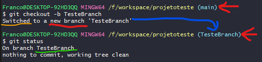

# Comandos Básicos Git

- `git init` --- inicializa a pasta para virar um repositório.
- `git add .` --- pega tudo oq foi modificado e adiciona no stage para dar o commit.
- `git commit -m "descrição do commit aqui com aspas"` - faz o commit e deixa uma mensagem.
- `git status` --- checa o status do repositório se tem alguma alteração.
- `git config --list` --- para listar as config (apertar Q para sair).
- `git remote -v` --- mostra o link do repositório remoto cadastrado.
- `git push origin master` --- envia para a branch master do repositório remoto q esta usando o alias origin (obs: se o rep for criado no github vai ser *origin main*).
- `git pull origin master` --- faz o download dos arquivos atualizados do repositório remoto.
- `git clone "link do repositório sem aspas"` --- clona o repositório para a tua maquina.
- `git reset` ou `git reset nomeDoArquivo` --- desfaz o git add, se ainda não foi feito o commit. 
- `git commit --allow-empty -m "Empty-Commit"` --- allow-empty é para fazer commits vazios, ou seja, sem ter dado add em nada.
- `git log --oneline --graph --color --all --decorate` ---  mostra o log de commits e branchs.

Se você criar um repositório no PC e quiser upar pro github, tem que criar o rep no github, ai ele vai dar os comandos para usar ja com o link certinho só copiar e colar, todavia os comandos são os seguintes:

- `git remote add origin "link sem aspas"`
- `git branch -M main` --- o git cria a branch com o nome de master, se usar esse comando ele vai mudar o nome para main.
- `git push -u origin main`

## Comandos Branching 

Para criar uma nova branch use o comando:  
`git checkout -b nomeDaBranch`  
Esse comando cria e já muda o projeto para a branch criada.  

Ele é como uma versão reduzida destes dois comandos:  
`git branch nomeDaBranch`  - Apenas cria a branch.  
`git checkout nomeDaBranch` - Apenas alterna o projeto para a branch declarada.   

[Git Basic Branching and Merging - Documentação oficial Git](https://git-scm.com/book/en/v2/Git-Branching-Basic-Branching-and-Merging)

# Comandos Bash Úteis

- `openssl sha1 nomedoarquivo` --- gera o hash sha1 do arquivo
- `cat` --- exibe o conteúdo de um arquivo no console

# Configurações Úteis/Importantes

### Configurar o autor dos commits:

- `git config --global user.email "seu email com aspas"`
- `git config --global user.name "nome do usuário sem aspas"`

### Para não precisar ficar entrando no site do git para digitar senha toda vez que você der commit você vai precisar fazer o seguinte:

Primeiro gerar uma chave SSH publica e privada, que vão servir na tua autenticação.

Depois você clona seus repositórios usando o link SSH.

- #### Para gerar uma chave ssh no bash para usar no github, digite esse comando:
  
  - `ssh-keygen -t ed25519 -C "seu email sem aspas"`
  - o -C tem q ser maiusculo.
  - caminho padrão que fica salvo as chaves publicas e privadas é: `c:/Users/NomeUsuario/.ssh/`
  - da pra abrir pelo bash usando o comando `cat nomedoarquivo.pub`
  - Então você pode copiar o conteúdo do arquivo ssh publico (.pub), e colocar no github na area das chaves SSH.

- ##### Depois para colocar no git do pc, vc vai na pasta .ssh pelo git bash, e digita os comandos:
  
  - `eval $(ssh-agent -s)`
  - `ssh-add id_ed25519`
  - Esse id é o nome do arquivo q foi gerado, e é o sem .pub, porque agora você vai usar a chave privada e não a publica.
  - Ai você vai digitar a senha q vc colocou no arquivo na hora de gerar, e pronto está configurado.

- **Para clonar um repositório como SSH:**
  
  - no github tem um botão "Code" no menu que ele abra tem uma opção SSH, então você copia o link dessa opção.
  - no bash você digita o seguinte comando e coloca o link ssh que você copiou:  
  `git clone "link ssh sem aspas"`
  - Então na primeira vez vai precisar dar yes para botar a key e o github nos conhecidos do teu git.

Depois disso é só usar, e a cada commit vc só vai precisar digitar no bash a senha que você colocou na hora de criar a chave SSH.
