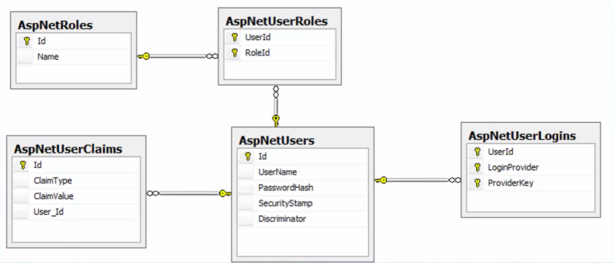
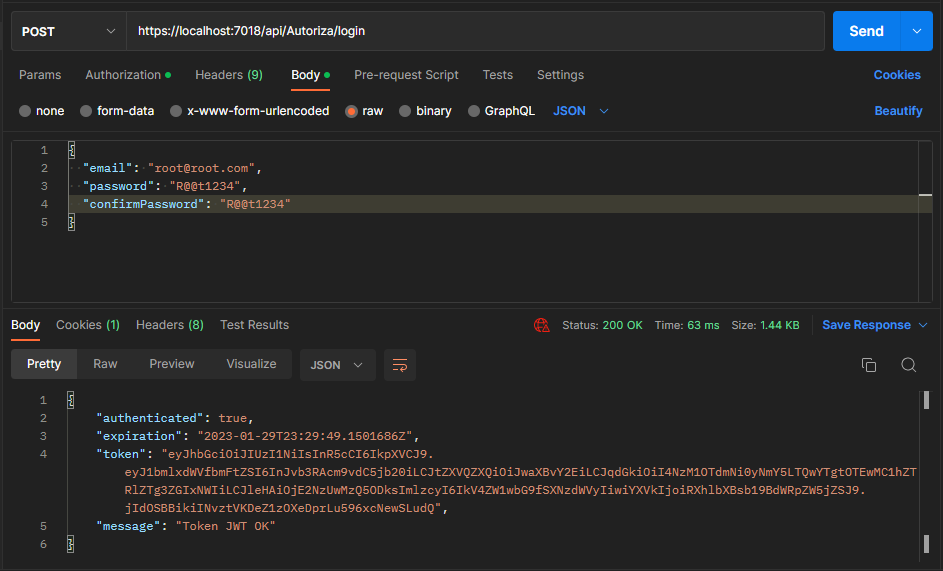
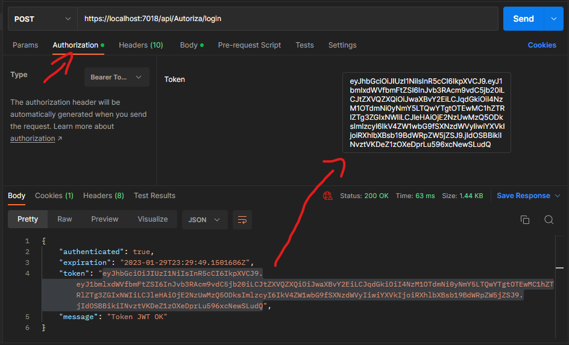
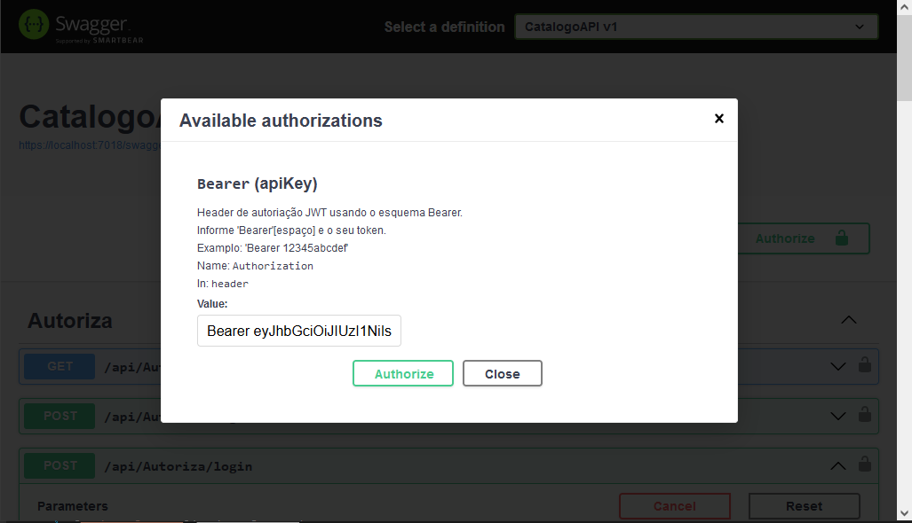

***Essa anotação ainda está em construção, ainda há algumas coisas desorganizadas, e outras que precisam ser revisadas.***


# Índice

- [Índice](#índice)
- [Anotações](#anotações)
  - [Oque é uma API](#oque-é-uma-api)
  - [Para que serve uma API](#para-que-serve-uma-api)
  - [**PRECISA ADICIONAR** Oque é Rest/RestFull](#precisa-adicionar-oque-é-restrestfull)
  - [**PRECISA ADICIONAR** Oque Torna uma API Rest/RestFull](#precisa-adicionar-oque-torna-uma-api-restrestfull)
  - [Alguns sites de APIs](#alguns-sites-de-apis)
  - [Dicas Importantes](#dicas-importantes)
  - [Comandos dotnet para criar e executar api](#comandos-dotnet-para-criar-e-executar-api)
  - [Oque é o Swagger](#oque-é-o-swagger)
  - [Classes Controller](#classes-controller)
    - [O básico para uma classe controller é:](#o-básico-para-uma-classe-controller-é)
  - [Caminho URL API](#caminho-url-api)
  - [ORM (Object Relational Mapper)](#orm-object-relational-mapper)
  - [Oque é o Entity Framework?](#oque-é-o-entity-framework)
  - [CRUD](#crud)
  - [Verbos HTTP](#verbos-http)
  - [Comandos DotNet para instalar pacotes](#comandos-dotnet-para-instalar-pacotes)
  - [Entidades (Entities)](#entidades-entities)
  - [Classes Context](#classes-context)
  - [AppSettings](#appsettings)
  - [Connection Strings](#connection-strings)
  - [Configurando a conexão com a DB na Program.cs](#configurando-a-conexão-com-a-db-na-programcs)
  - [Oque é o Migrations?](#oque-é-o-migrations)
    - [Executando o Migrations](#executando-o-migrations)
  - [DataAnnotations](#dataannotations)
  - [Validação](#validação)
    - [Criando Atributo customizado](#criando-atributo-customizado)
    - [IValidatableObject](#ivalidatableobject)
  - [Rotas / Endpoints](#rotas--endpoints)
    - [Informar mais de um parâmetro na action](#informar-mais-de-um-parâmetro-na-action)
    - [Oque acontece se colocar uma barra no inicio do endpoint da action?](#oque-acontece-se-colocar-uma-barra-no-inicio-do-endpoint-da-action)
    - [Múltiplos endpoints na mesma action](#múltiplos-endpoints-na-mesma-action)
  - [Restrição de Rotas](#restrição-de-rotas)
    - [Tabela de Referencia de Restrições](#tabela-de-referencia-de-restrições)
  - [Tipos de retorno de ação](#tipos-de-retorno-de-ação)
    - [Tipo Especifico](#tipo-especifico)
    - [IActionResult](#iactionresult)
    - [`ActionResult<T>`](#actionresultt)
  - [Model Binding](#model-binding)
    - [QueryStrings](#querystrings)
    - [Valores de Formulários](#valores-de-formulários)
    - [Atributos para definir de onde é a fonte dos dados](#atributos-para-definir-de-onde-é-a-fonte-dos-dados)
    - [\[FromServices\]](#fromservices)
    - [Atribuição automática](#atribuição-automática)
  - [Métodos Assíncronos](#métodos-assíncronos)
    - [Vale a pena usar Actions Assíncronas?](#vale-a-pena-usar-actions-assíncronas)
  - [Middleware](#middleware)
  - [Delegate](#delegate)
  - [Modelo de Configuração](#modelo-de-configuração)
  - [Filtros](#filtros)
    - [Filtros: Implementação Síncrona](#filtros-implementação-síncrona)
    - [Filtros: Implementação Assíncrona](#filtros-implementação-assíncrona)
    - [Filtros: Escopo e ordem de execução](#filtros-escopo-e-ordem-de-execução)
    - [Exemplo Filtro Personalizado (ApiLoggingFilter)](#exemplo-filtro-personalizado-apiloggingfilter)
  - [Tratando erros globalmente com extensão de middleware](#tratando-erros-globalmente-com-extensão-de-middleware)
  - [Logging](#logging)
    - [Criando um Log](#criando-um-log)
    - [Criando um registro de log customizado](#criando-um-registro-de-log-customizado)
  - [Informações interessantes](#informações-interessantes)
    - [Serviço Scoped, Singleton e Transient](#serviço-scoped-singleton-e-transient)
  - [Soluções de problemas](#soluções-de-problemas)
    - [Problema de Serialização CÍCLICA](#problema-de-serialização-cíclica)
  - [Otimizando o código](#otimizando-o-código)
    - [HTTP GET](#http-get)
      - [Dicas:](#dicas)
- [Repository Pattern](#repository-pattern)
  - [Oque é o padrão Repositório?](#oque-é-o-padrão-repositório)
  - [Implementação do Repositório](#implementação-do-repositório)
    - [Passos Teóricos](#passos-teóricos)
    - [Prática (Síncrono)](#prática-síncrono)
    - [Unit Of Work](#unit-of-work)
  - [Alterando o Repository de SÍNCRONO para ASSÍNCRONO](#alterando-o-repository-de-síncrono-para-assíncrono)
    - [Implementando](#implementando)
  - [Vale a pena usar o Padrão Repository e Unit of Work com EF Core?](#vale-a-pena-usar-o-padrão-repository-e-unit-of-work-com-ef-core)
    - [Uso do IEnumerable ou IQueryable na interface do Repository](#uso-do-ienumerable-ou-iqueryable-na-interface-do-repository)
    - [Usar ou não uma camada de serviços com esses padrões?](#usar-ou-não-uma-camada-de-serviços-com-esses-padrões)
    - [Conclusão usar ou não usar esses padrões?](#conclusão-usar-ou-não-usar-esses-padrões)
    - [Links Artigos](#links-artigos)
    - [Links Úteis Relacionados](#links-úteis-relacionados)
    - [Artigos sobre não usar ou quando usar o EF junto com o Repository](#artigos-sobre-não-usar-ou-quando-usar-o-ef-junto-com-o-repository)
- [DTO e AutoMapper](#dto-e-automapper)
  - [DTO - Data Transfer Objects](#dto---data-transfer-objects)
  - [AutoMapper](#automapper)
  - [Prática](#prática)
- [Paginação de Dados](#paginação-de-dados)
    - [Forma 1](#forma-1)
      - [Implementação](#implementação)
    - [Forma 2](#forma-2)
      - [Implementação](#implementação-1)
    - [Forma 2 Adicional](#forma-2-adicional)
      - [Implementação](#implementação-2)
    - [Paginação Assíncrona](#paginação-assíncrona)
- [Segurança](#segurança)
  - [JWT - JSON Web Token](#jwt---json-web-token)
    - [Token JWT](#token-jwt)
      - [Vantagens](#vantagens)
      - [Processo de Autenticação](#processo-de-autenticação)
      - [Implementação](#implementação-3)
        - [Preparando o projeto: Habilitando o Identity](#preparando-o-projeto-habilitando-o-identity)
        - [Tabelas geradas pelo Identity](#tabelas-geradas-pelo-identity)
        - [Configurando o Identity no projeto](#configurando-o-identity-no-projeto)
        - [Registro de Usuário, Login e Token](#registro-de-usuário-login-e-token)
        - [Testando com o Postman](#testando-com-o-postman)
        - [Testando com o Swagger](#testando-com-o-swagger)
        - [Link JWT para teste do Token](#link-jwt-para-teste-do-token)
- [Leituras interessantes](#leituras-interessantes)


# Anotações

## Oque é uma API

Uma API (Application Programming Interface) é uma forma de comunicação entre computadores ou programas de computadores.
Em outras palavras, é um software que fornece informações para outro software.

API é um software que faz a intermediação entre o software do cliente com o software do servidor. Exemplo: um garçon de um restaurante seria uma API.

[Voltar ao Índice](#índice)

---

## Para que serve uma API

Principal função de uma API é: Disponibilizar métodos (endpoints) e serviços, permitindo a comunicação e integração entre diferentes sistemas.

[Voltar ao Índice](#índice)

---

## **PRECISA ADICIONAR** Oque é Rest/RestFull


[Voltar ao Índice](#índice)

---

## **PRECISA ADICIONAR** Oque Torna uma API Rest/RestFull


[Voltar ao Índice](#índice)

---

## Alguns sites de APIs

date.nager.at - site de api de feriados.
dog.ceo/dog-api - side de api de imagens de cachorros.

[Voltar ao Índice](#índice)

---

## Dicas Importantes

- SEMPRE busque ler primeiro a documentação da API para ver como ela funciona e como usa-la.


- `dotnet --help` - use para buscar comandos.

[Voltar ao Índice](#índice)

---

## Comandos dotnet para criar e executar api

Comando para criar um projeto de web api:
`dotnet new webapi`

Comando para rodar e quando alterar o código ja recompilar em tempo de execução (similar ao HotReload do vs community):
`dotnet watch run`

[Voltar ao Índice](#índice)

---

## Oque é o Swagger

Swagger é um frontend para testar apis em ambiente de desenvolvimento, não é exatamente necessário mas é um recurso que facilita os testes.

[Voltar ao Índice](#índice)

---

## Classes Controller

Classes Controller são classes que você vai colocar os métodos relacionados às ações de determinada api, exemplo, Get de produto, Set de produto, e elas devem ser separadas relacionadas ao contexto dela, pro exemplo uma controller de produtos deve ter os controladores relacionado a produtos apenas, não devem mexer em coisas do usuário por exemplo, se precisa mexer no usuário é necessário fazer uma controller para/relacionada ao usuário.  

"Uma controller nada mais é que o ponto de entrada que nos vamos disponibilizar os nossos métodos".

**É necessário fazer o nome das controllers terminando com a palavra Controller, exemplo UsuarioController, ProdutoController...**

### O básico para uma classe controller é:  
Esses [atributos](../2%20-%20%20C%23/Anota%C3%A7%C3%B5es%20CSharp.md/#Atributos) no cabeçalho da classe controller
```c#
    [ApiController]
    [Route("[controller]")]
```
E a classe herdar a ControllerBase, não é Controller, é ControllerBase.
e fazer uma "injeção de dependência" através do construtor.
```c#
private readonly AgendaContext _context;
public ContatoController(AgendaContext context)
{
    _context = context;
}
```
Para todos os métodos http com exceção do get, você tem que chamar o método:
`_context.SaveChanges();`  
Senão ele não salva no banco de dados.

[Voltar ao Índice](#índice)

---

## Caminho URL API

O endereço do método no link, é formado pelo localhost (ou o domínio que ele estiver) / nome do controlador sem a palavra controller exemplo UsuarioController, ele vai mostrar só Usuário, e dai no nome que você colocou em cima do método, exemplo:
```c#
[HttpGet("ObterDataHoraAtual")]
public IActionResult ObterDataHora()
```

Exemplo de como o link vai ficar:  
`https://localhost:7275/Usuario/ObterDataHoraAtual`  

[Voltar ao Índice](#índice)

--- 

## ORM (Object Relational Mapper)

ORM (Object Relational Mapper) é uma técnica de mapeamento objeto relacional que permite fazer uma relação dos objetos com os dados que os mesmos representam. É isso que o Entity Framework e o Dapper são, e existem varios outros ORM's disponiveis.

[Voltar ao Índice](#índice)

---

## Oque é o Entity Framework?

O Entity Framework é um framework ORM (Object-Relational Mapping) criado para facilitar a integração com o banco de dados, mapeando tabelas e gerando comandos SQL de forma automática.  
Resumindo: ele gera os código que você colocaria na query automaticamente.  

[Voltar ao Índice](#índice)

--- 

## CRUD

- C - CREATE (Insert)  
- R - READ (Select)  
- U - UPDATE (Update)  
- D - DELETE (Delete)  

[Voltar ao Índice](#índice)

---

## Verbos HTTP
- Get - Selecionar/Buscar Dados.  
- Post - Enviar dados.   
- Put - Atualizar dados.    
- Patch - Atualizar parcialmente dados.   
- Delete - Deletar dados.   

[Voltar ao Índice](#índice)

---

## Comandos DotNet para instalar pacotes

`dotnet tool install --global dotnet-ef` - Ferramenta para inserir comandos no entity framework via terminal, só precisa instalar uma vez no computador.  

`dotnet add package Microsoft.EntityFrameworkCore.Design` - Pacote para instalar o entity framework no PROJETO, precisa instalar ele em todo projeto que for usar o entity framework.  

`dotnet add package Microsoft.EntityFrameworkCore.SqlServer` - Pacote para instalar o modulo do entity framework para o SQL Server, o EF é modular então precisa instalar o Design q é uma base, e o modulo referente ao banco de dados que você for usar, nesse caso o SQL Server. Também precisa instalar em todo projeto.  

[Voltar ao Índice](#índice)

---

## Entidades (Entities) 

São classes no programa que também são tabelas no banco de dados.
Nelas precisa ter propriedades com os mesmos nomes que vai ter na tabela do banco de dados.

[Voltar ao Índice](#índice)

---
## Classes Context

Elas fazem uma ligação do programa com o banco de dados, seja de conexão quanto de referenciamento de entidades.
A classe context herda a classe DbContext, nela precisa ter um construtor que vai fazer a ligação da conexão, e vai ter uma propriedade do tipo:  
```c# 
public DbSet<NomeDaEntidade> NomeDaEntidade { get; set; }
```  
Que vai servir para referenciar a entidade, senão ela só vai existir la nas entities mas nao vai funcionar.

[Voltar ao Índice](#índice)

---

## AppSettings

Existe 2 arquivos json no projeto, um é o appsetings, e um é o appsettings.Development, o primeiro você configura com as coisas que você vai precisar na hora de implementar o programa em ambiente de produção, e o segundo você usa com as configurações para o ambiente de desenvolvimento, por exemplo configurar para usar um banco de dados que é só para desenvolvimento e configurar um comando para impedir de mandar um email aos usuários.

PS: o appsetting.Developtment.json no visual studio community fica escondido, ao lado do appsetting.json tem um triangulo para abrir como se fosse uma pasta, clique nele e vai aparecer o .Development abaixo.

[Voltar ao Índice](#índice)

---

## Connection Strings

Você vai colocar a connection string logo depois de fechar a chave do Logging, a connection string do sql server express é assim:
```json
"ConnectionStrings": {
    "ConexaoPadrao": "Server=localhost\\sqlexpress; Initial Catalog=Agenda; Integrated Security=True"
  }
```
O `"ConnectionStrings":` tem que ser sempre esse nome, mas o "ConexaoPadrao" pode ser o nome que você quiser.

[Voltar ao Índice](#índice)

---

## Configurando a conexão com a DB na Program.cs

```c#
builder.Services.AddDbContext<AgendaContext>(options =>
        options.UseSqlServer(builder.Configuration
        .GetConnectionString("ConexaoPadrao")));
```
Aqui nos estamos dizendo para o builder adicionar um DbContext do tipo AgendaContext, e passando algumas opções, dizendo para usar SqlServer, e passando a connection string (caminho para acessar o banco de dados e como fazer login) que está no appsettings.json ou appsettings.Development.json.  

Daria para colocar a connection string direto aqui, mas se um dia precisar mudar teria que recompilar o código, e estando la no json ele vai estar junto com o programa compilado e ai é mais fácil alterar.  

[Voltar ao Índice](#índice)

---

## Oque é o Migrations?

O Migrations é um mapeamento que o entity framework faz das nossas classes (entities) para transforma-las em tabelas.  
Ele vai executar nas classes que tiverem referenciadas na classe Context.  
"Migrations é um código que serve para espelhar as suas alterações no código no banco de dados".  
Ele tem um método Up para aplicar mudanças nas tabelas, e um método Down para reverte-las.  

[Voltar ao Índice](#índice)

### Executando o Migrations

Para executar o migrations é preciso fazer o comando manualmente via terminal, o comando é:  
`dotnet-ef migrations add CriacaoTabelaContato`  
No caso o **CriacaoTabelaContato** é apenas um nome para definir que você fez nessa migração, como era uma migração simples de apenas uma tabela, foi dado esse nome.   

Na pasta Migrations que o comando vai criar, tem alguns dados da tabela que ele criou.  
Você pode notar duas coisas que ele faz automaticamente:  
Primeiro, ele vai alterar o nome da Entities que deve ser nomeada no singular, para o plural.  
Segundo se a classe tiver uma propriedade Id ele vai automaticamente reconhecer e usar ela como uma identity e adicionar a constraint de Primary Key.  

Ai para adicionar essa tabela no banco de dados use o comando:  
`dotnet-ef database update`  

[Voltar ao Índice](#índice)

---

## DataAnnotations

DataAnnotation é um [Atributo](../2%20-%20%20C%23/Anota%C3%A7%C3%B5es%20CSharp.md/#Atributos), com ele podemos definir um comportamento diferente do padrão para uma propriedade ou método.

**Alguns Atributos:**  


- `[Key]` - Identifica uma propriedade como uma chave primaria na tabela, normalmente não é usado pois o EFCore automaticamente define uma propriedade como chave primaria se você colocar Id ou AlgumNomeId (Id no final do nome).  
- `[Table("nome")]` - Define um nome para a tabela que a classe será mapeada.   Também não é muito usado pois o EFCore também faz isso automaticamente quando você define as classes no DbContext.  
- `[Column]` - Define a coluna na tabela que a propriedade será mapeada, normalmente usado para especificar a propriedade na tabela (exemplos abaixo).  
- `[DataType]` - Especifica um tipo de dados adicional a uma propriedade.  
- `[ForeignKey]` - Especifica que a propriedade é usada como uma chave estrangeira, pouco usado pelo mesmo motivo do Key.  
- `[NotMapped]` - Exclui a propriedade do mapeamento.  
- `[StringLenght]` - Define o tamanho mínimo e máximo permitido para o tipo.  
- `[Required]` - Especifica que o valor do campo é obrigatório.  
- `[RegularExpression(".+\\@.+\\..+")]` - Permite usar expressões regulares em validações mais específicas.
- `[Compare("Senha")]` - Compara duas propriedades que o usuário informou (util para validação de senha, exemplo aquele campo para repetir a senha para confirmar).
**Fonte: Curso WebAPI AspNet Core do Macoratti.**

Mais atributos:  
[DataAnnotations - Learn EF Core](https://www.learnentityframeworkcore.com/configuration/data-annotation-attributes)  
[Data Annotation Attributes - DevExpress](https://docs.devexpress.com/AspNet/400998/components/site-navigation-and-layout/form-layout/concepts/data-annotation-attributes)  
[Model validation in ASP.NET Core MVC and Razor Pages - Microsoft Learn](https://learn.microsoft.com/en-us/aspnet/core/mvc/models/validation?view=aspnetcore-7.0)

**Exemplos de uso:**  

Na classe da Entity/Models:
```c#
// Propriedades do tipo string
// Com mensagem de erro:
[StringLength(80), ErrorMessage = "Texto muito longo"]
// Ou sem mensagem de erro:
[StringLength(80)]
public string Nome { get; set; }

// Propriedades do tipo decimal
[Column(TypeName = "decimal(18,4)")]
public decimal Valor { get; set; }

// Tornando obrigatório
// Com mensagem de erro:
[Required(ErrorMessage = "Essa propriedade é obrigatória")]
// Ou sem mensagem de erro:
[Required]
public string Nome { get; set; }


// Também dá para combinar:
[Required]
[StringLength(80)]
public string Nome { get; set; }

// Também dá para especificar o máximo e o mínimo. 
[StringLength(80, MinimumLength=4)]
public string Nome { get; set; }

// E combinar com mensagem de erro:
[Required(ErrorMessage = "Essa propriedade é obrigatória")]
[StringLength(80), ErrorMessage = "Texto muito longo"]
public string Nome { get; set; }

// Exemplo de validação especifica de email.
[RegularExpression(".+\\@.+\\..+", ErrorMessage = "Informe um email válido...")]
public string Email { get; set; }
```
**Fonte: Curso WebAPI AspNet Core do Macoratti.**

OBS: No curso o Macoratti diz que usar DataAnnotations deixa o código "meio poluído" e que seria mais "elegante" usar a Fluent API para isso. Pelo que deu a entender é só uma questão estética não tendo muita diferença em qualidade.

[Voltar ao Índice](#índice)

---

## Validação

A validação pode ser feita de duas formas, usando os atributos [DataAnnotations](#dataannotations), ou uma interface `IValidatableObject`.  

Usando atributos, nós temos os atributos pré definidos, alguns exemplos aqui: [DataAnnotations](#dataannotations).    
E temos também a possibilidade de criar um atributo customizado.  

### Criando Atributo customizado

Para criar um atributo customizado fazemos o seguinte.    
- Primeiro é recomendado criar uma classe dentro de uma pasta **Validations**, essa classe deve ter no final de seu nome OBRIGATORIAMENTE a palavra **Attribute**, exemplo: PrimeiraLetraMaiusculaAtribbute.   
- Ela deve herdar de **ValidationAttribute**.  
- Deve sobrescrever o método **IsValid**.  
- O **object? value** é o dado de entrada que será validado.  
- O ValidationContext traz informações do contexto que o atributo de validação está sendo executado (ele é necessário mesmo que você não use ele diretamente).  
  
Seu método principal deve se parecer com isso:    
```c#
protected override ValidationResult? IsValid(object? value,
            ValidationContext validationContext)
{
  // seu código aqui
  // Exemplo da primeira letra maiúscula
  if (value == null || string.IsNullOrEmpty(value.ToString()))
  {
      return ValidationResult.Success;
  }

  var primeiraLetra = value.ToString()[0].ToString();
  if (primeiraLetra != primeiraLetra.ToUpper())
  {
      return new ValidationResult("A primeira letra do nome tem que ser maiúscula!");
  }
  return ValidationResult.Success;
}
```
Explicando o código:  
Primeiramente não é a função desse atributo do exemplo verificar se o valor é ou não nulo, sua função é apenas verificar a primeira letra da string, porém se for nulo ele não funciona, então se for nulo ele retorna um sucesso antes de verificar a letra e deixa a cargo das outras validações decidirem se é permitido ou não ser nulo.  
Não sendo nulo ele vai fazer sua operação, sempre que você retorna um ValidationResult que não seja `.Success` ele considera que é um erro 400, pois quando há um sucesso na validação o retorno é silencioso (não tem como mandar mensagem).  

### IValidatableObject

Esse formato de validação é feito direto na model do produto por exemplo, ela tem como desvantagem não ser reaproveitável pois ela é criada direto na model para aquela model apenas, mas tem como vantagem permitir validações mais complexas e **bem** especificas, como por exemplo verificar alguma interação entre propriedades como só ser valido se propriedade A e propriedade B tiverem determinados dados.

Para faze-lo:
- A classe de modelo tem que implementar a interface **IValidatableObject**.
- O método de validação é colocado abaixo das propriedades da model.

```c#
namespace Models;
public class Produto : IValidatableObject
{
  public int ProdutoId { get; set; }
  public string? Nome { get; set; }
  public string? Descricao { get; set; }
  public decimal Preco { get; set; }
  public float Estoque { get; set; }
  public DateTime DataCadastro { get; set; }

  public IEnumerable<ValidationResult> Validate(ValidationContex validationContext)
  {
    if (!string.IsNullOrEmpty(this.Nome))
        {
            var primeiraLetra = this.Nome[0].ToString();
            if (primeiraLetra != primeiraLetra.ToUpper())
            {
                yield return new
                  ValidationResult("Aprimeira letra do produto deve ser maiúscula",
                  new[]
                  { nameof(this.Nome) }
                  );
            }
        }

        if (this.Estoque <= 0)
        {
            yield return new
                ValidationResult("O estoque deve ser maior que zero",
                new[]
                { nameof(this.Estoque) }
                );
        }

        // exemplo de interação de propriedades que
        // essa forma de validação permite e a via Atributo não
        // "Easter Egg"
        if (this.Nome == "Café" && this.Estoque == 0)
        {
            yield return new
                ValidationResult("CAFÉÉÉÉ!!! QUERO CAFÉÉÉ!!! NÃO TEM CAFÉÉÉ!!!!!!!!!",
                new[]
                { "Easter Egg" });
        }

  }
}
```

[Voltar ao Índice](#índice)

---

## Rotas / Endpoints

Quando você tem mais de um método do mesmo tipo que pega exatamente as mesmas propriedades, ele da erro, mesmo eles tendo nomes diferentes (e é necessário ter nomes diferentes a menos que seja um polimorfismo do tipo overload), para o mapeamento de controladores ambos são a mesma coisa.

Para resolver isso há duas opções

Uma é fazer o sistema reconhecer o nome do método na rota:

No atributo de rota que fica no cabeçalho da classe da para fazer isso:
```c#
[Route("[controller/{action}]")]
```
E então na URL voce vai digitar o `NomeDaControladora/NomeDoMetodo`.  

A outra forma é adicionar rotas nos métodos em si:  

```c#
[HttpGet("produtos")]
```
Ai na hora de escrever na URL, usando o exemplo acima, vai ser o `NomeDaControladora/produtos`.

</br>

### Informar mais de um parâmetro na action 

Para mais de um parâmetro tem que colocar uma barra entre as chaves
```c#
[HttpGet("{id}/{produto}")]
```
Exemplo de como fica a url `https://localhost:7275/Produtos/1/Refri`
Ou seja, NomeDoControlador/id/produto

Também é possível definir um valor padrão, quando o valor não for informado ele usa esse valor padrão, exemplo:
```c#
[HttpGet("{id}/{produto=Pastel}")]
```

Para múltiplos parâmetros confira também [Model Binding](#model-binding)

[Voltar ao Índice](#índice)

### Oque acontece se colocar uma barra no inicio do endpoint da action?

Se colocar uma barra no endpoint da action, ele ignora a rota que está no atributo Route que está no cabeçalho da classe do controlador.
```c#
[HttpGet("/primeiro")]
```
A URL fica assim: `https://localhost:7275/primeiro`  
Mesmo que na rota da classe tenha mais coisas, exemplo: `Route("[sistema/v2/api/Controller]")` ele vai ignorar toda essa rota e fazer como no exemplo acima.  

[Voltar ao Índice](#índice)

### Múltiplos endpoints na mesma action

Uma action também pode ter mais de um EndPoint.  
Exemplo:  
```c#
[HttpGet("primeiro")]
[HttpGet("teste")]
[HttpGet("/primeiro")]
public ActionResult<Produto> Get()
{}
```
Nesse exemplo essa action vai poder ser acessada por 3 exemplos de rotas diferentes:  
`https://localhost:7275/produtos/primeiro`
`https://localhost:7275/produtos/teste`
`https://localhost:7275/primeiro`

[Voltar ao Índice](#índice)

## Restrição de Rotas

É possível restringir os parâmetros informados nas rotas. Definindo um tipo a ser recebido, valor mínimo, máximo, somente letras, etc.  

**Apesar de servir, isso não deve ser usado como validação e sim como filtro** (vide o aviso abaixo retirado do site da Microsoft), a ideia aqui é criar um seletor de caminhos, um exemplo seria você ter dois gets que recebem um id, mas um realmente é um id de inteiro, e o outro é para buscar via nome, mas na URL o campo forma uma rota igual nos 2, exemplo:  
Com int: `https://localhost:7275/produtos/1`  
Com letras: `https://localhost:7275/produtos/abc`   
O campo de ambos fica após produtos, mesmo que no endpoint um esteja escrito ID e um esteja escrito NOME, o sistema não diferencia diretamente, mas por tipo é possível, porém `1` pode ser visto como string, então se for usar tem que ser uma definição que aceite apenas letras, então o sistema vai ver e "opa isso aqui é um numero, e o único get que tem aqui que aceita números é esse; E esse aqui é uma letra, então essa solicitação vai para esse outro get aqui que aceita apenas letras".


Exemplos:  
```c#
// Limita a ser um inteiro
[HttpGet("{id:int}")]

// Limita que seja um inteiro e seu valor mínimo seja 1
[HttpGet("{id:int:min(1)}")]

// Somente letras maiúsculas ou minusculas podem ser inseridos
[HttpGet("{valor:alpha}")]

// Somente letras maiúsculas ou minusculas podem ser inseridos
// e com exatamente 5 dígitos, se for menos de 5 ou
// mais de 5 não funciona
[HttpGet("{valor:alpha:length(5)}")]

// No mínimo 5 dígitos
[HttpGet("{valor:alpha:minlength(5)}")]
// No máximo 5 dígitos
[HttpGet("{valor:alpha:maxlength(5)}")]
```


### Tabela de Referencia de Restrições


| :warning: AVISO :warning:                                                                                                                                                                                                                                                                                                                                                                                         |
| ----------------------------------------------------------------------------------------------------------------------------------------------------------------------------------------------------------------------------------------------------------------------------------------------------------------------------------------------------------------------------------------------------------------- |
| Não use restrições para a validação de entrada. Se as restrições forem usadas para validação de entrada, a entrada inválida resultará em uma resposta `404 NotFound`. A entrada inválida deve produzir um `400 Bad Request` com uma mensagem de erro apropriada. ***As restrições de rota são usadas para desfazer a ambiguidade entre rotas semelhantes***, não para validar as entradas de uma rota específica. |
|                                                                                                                                                                                                                                                                                                                                                                                                                   |

**Na minha opinião com base no meu conhecimento atual, em casos como o min(1) onde digitar 0 iria resultar em um 404 NotFound seria válido usar isso.**  

| restrição         | Exemplo                                     | Correspondências de exemplo          | Observações                                                                                                               |
| ----------------- | ------------------------------------------- | ------------------------------------ | ------------------------------------------------------------------------------------------------------------------------- |
| int               | `{id:int}`                                  | 123456789, -123456789                | Corresponde a qualquer inteiro                                                                                            |
| bool              | `{active:bool}`                             | true, FALSE                          | Correspondências true ou false.                                                                                           | Não diferenciam maiúsculas de minúsculas. |
| datetime          | `{dob:datetime}`                            | 2016-12-31, 2016-12-31 7:32pm        | Corresponde a um valor válido DateTime na cultura invariável. Consulte o aviso anterior.                                  |
| decimal           | `{price:decimal}`                           | 49.99, -1,000.01                     | Corresponde a um valor válido decimal na cultura invariável. Consulte o aviso anterior.                                   |
| double            | `{weight:double}`                           | 1.234, -1,001.01e8                   | Corresponde a um valor válido double na cultura invariável. Consulte o aviso anterior.                                    |
| float             | `{weight:float}`                            | 1.234, -1,001.01e8                   | Corresponde a um valor válido float na cultura invariável. Consulte o aviso anterior.                                     |
| guid              | `{id:guid}`                                 | CD2C1638-1638-72D5-1638-DEADBEEF1638 | Corresponde a um valor Guid válido.                                                                                       |
| long              | `{ticks:long}`                              | 123456789, -123456789                | Corresponde a um valor long válido.                                                                                       |
| minlength(value)  | `{username:minlength(4)}`                   | Rick                                 | A cadeia de caracteres deve ter, no mínimo, 4 caracteres.                                                                 |
| maxlength(value)  | `{filename:maxlength(8)}`                   | MyFile                               | A cadeia de caracteres não pode ser maior que 8 caracteres.                                                               |
| length(length)    | `{filename:length(12)}`                     | somefile.txt                         | A cadeia de caracteres deve ter exatamente 12 caracteres.                                                                 |
| length(min,max)   | `{filename:length(8,16)}`                   | somefile.txt                         | A cadeia de caracteres deve ter, pelo menos, 8 e não mais de 16 caracteres.                                               |
| min(value)        | `{age:min(18)}`                             | 19                                   | O valor inteiro deve ser, pelo menos, 18.                                                                                 |
| max(value)        | `{age:max(120)}`                            | 91                                   | O valor inteiro não deve ser maior que 120.                                                                               |
| range(min,max)    | `{age:range(18,120)}`                       | 91                                   | O valor inteiro deve ser, pelo menos, 18, mas não maior que 120.                                                          |
| alpha             | `{name:alpha}`                              | Rick                                 | A cadeia de caracteres deve consistir em um ou mais caracteres a-z alfabéticos e não diferencia maiúsculas de minúsculas. |
| regex(expression) | `{ssn:regex(^\\d{{3}}-\\d{{2}}-\\d{{4}}$)}` | 123-45-6789                          | A cadeia de caracteres deve corresponder à expressão regular. Confira dicas sobre como definir uma expressão regular.     |
| required          | `{name:required}`                           | Rick                                 | Usado para impor que um valor não parâmetro está presente durante a geração de URL.                                       |

Fonte da tabela: [Roteamento no ASP.NET Core - Microsoft Learn](https://learn.microsoft.com/pt-br/aspnet/core/fundamentals/routing?view=aspnetcore-7.0). (Leitura recomendada, documentação rica em informações interessantes sobre roteamento.)

[Voltar ao Índice](#índice)

---

## Tipos de retorno de ação

Existem alguns tipos de retornos para os métodos actions, como por exemplo:

### Tipo Especifico

Esse tipo de retorno pode ser complexo ou primitivo (int, string, decimal...).
Usando um tipo especifico você perde um pouco de versatilidade, pois ele só retorna o tipo, não permite retornar um Status Code por exemplo.

### IActionResult

IActionResult é um tipo de retorno que permite retornar vários tipos diferentes, desde que estejam dentro de algum Status Code, exemplo:

```c#
[HttpGet]
public IActionResult Get()
{
    var produto = _context.Produtos.FirstOrDefault();
    if(produto == null)
    {
        return NotFound();
    }
    return Ok(produto);
}
```


### `ActionResult<T>`

A classe abstrata ActionResult implementa a interface IActionResult, como resultado, tudo oque a IActionResult faz a ActionResult também faz e com alguns adicionais.  
Se for usar ActionResult sem o tipo, creio ser melhor usar a IActionResult, é para ser mais otimizado.  
Se for retornar o tipo, a `ActionResult<Tipo>` é o ideal, pois com ela você pode retornar assim:  
```c#
[HttpGet]
public ActionResult<Produto> Get()
{
    var produto = _context.Produtos.FirstOrDefault();
    if(produto == null)
    {
        return NotFound();
    }
    return produto;
}
```

A titulo de comparação, antes da ASP.Net Core 2.1 não tinha o ActionResult, então para retornar só o objeto usando o IActionResult, era retornado da seguinte forma: 
```c#
return new ObjectResult(produto);
```


Mais informações em: [Tipos de retorno de ação do controlador na API Web do ASP.NET Core - Microsoft Learn](https://learn.microsoft.com/pt-br/aspnet/core/web-api/action-return-types?view=aspnetcore-7.0)

[Voltar ao Índice](#índice)

---

## Model Binding

O Model Binding (Vinculação de Modelos) é um recurso que nos permite mapear dados de uma requisição HTTP para os parâmetros de uma Action de um controlador.

Esse mapeamento inclui todos os tipos de parâmetros: números, strings, arrays, listas, tipos complexos, listas de objetos, etc.

**Fonte de dados**

1. Valores de Formulários: (Post e Put) enviados no corpo do request.
2. Rotas: `[Route("api/[Controller]")]` ou `[HttpGet("{id}")]`. Verifique: [Rotas/Endpoints](#rotas--endpoints)
3. QueryStrings: `api/produtos/4?nome=Suco&ativo=true`


### QueryStrings

QueryStrings são dados passados direto na uri após uma interrogação, exemplo:  
neste link:  
`https://localhost:7275/Produtos/1?nome=Suco&gelado=true`  
a Query String é: `?nome=Suco&gelado=true`  
Nela temos o parâmetro nome e o parâmetro gelado sendo informados.  
O `&` serve para concatenar os parâmetros.

### Valores de Formulários

São valores recebidos no corpo do request, são usados para receber dados do tipo complexo, geralmente usado com Post e/ou Put.

### Atributos para definir de onde é a fonte dos dados

`[FromBody]` - Usando esse atributo você especifica que a propriedade vai pegar aquele atributo através do corpo do request.

Exemplo:
```c#
[HttpPost]
public ActionResult Put(int id, [FromBody] Produto produto)
{}
```
O id vai vim pela rota e o json do produto vai vir pelo corpo do request.

`[BindRequired]` - Usando esse atributo exige que o atributo seja informado, se não for ele vai retornar um erro 400.

Exemplo:
```c#
[HttpPost]
public ActionResult Put(int id, [BindRequired] string nome)
{}
```

`[BindNever]` - Informa ao Model Binder para não vincular informação ao parâmetro. É usado na Model/Entidade.  

Exemplo:
```c#
public class Categoria
{
    public int CategoriaId { get; set; }
    public string Nome { get; set; }
    
    [BindNever]
    public string ImagemUrl { get; set; }
}
```
Dessa forma o model binder vai ignorar a vinculação dessa propriedade, ou não permitir.

- `[FromForm]` - Utilize somente os dados recebidos do **formulário** enviado.
- `[FromRoute]` - Vincula apenas os dados que são oriundos da **rota de dados**.
- `[FromQuery]` - Recebe apenas os dados da cadeia de consulta (**QueryString**).
- `[FromHeader]` - Vincula os valores que vêm no **cabeçalho** da requisição HTTP.
- `[FromServices]` - Vincula o valor especificado à implementação que foi configurada no seu **container de injeção de dependência**.

Leitura adicional: [Model binding no ASP.NET Core - Microsoft Learn](https://learn.microsoft.com/pt-br/aspnet/core/mvc/models/model-binding?view=aspnetcore-7.0)

### [FromServices]

O atributo from services basicamente permite que você instancie um objeto que ja esteja carregado no services do program.cs.

Você precisa ter uma interface para ele e sua classe com sua função.  
Por exemplo, imagine um código de mensagem de saudação que irá receber o nome da pessoa.  
No program.cs você coloca a seguinte linha de comando: 
```c#
services.AddTransient<IMeuServico, MeuServico>()  
```
Ou seja, aqui você definiu um serviço, que será Transient que significa que ele irá criar uma nova instancia do serviço toda vez que você chama-lo (existe também scoped e singleton), e definiu com a interface e a classe qual serviço é.  
Mais sobre Scoped, Singleton e Transient em: [Serviço Scoped, Singleton e Transient](#serviço-scoped-singleton-e-transient)

E na controladora você coloca:
```c#
[HttpGet("saudacao/{nome}")]
public ActionResult<string> GetSaudacao([FromServices] IMeuServico meuServico, string nome)
{
  return meuServico.Saudacao(nome);
}
```
Você coloca o atributo FromServices e chama o objeto pela interface.  

Na realidade sua real utilidade segundo a documentação da microsoft é para injeção de dependência que exige construtor, um exemplo seria o _context do EFCore, onde você cria um readonly do _context, e no construtor carrega ele. Mas ai você tem algo que so vai usar uma vez ou poucas vezes que não compensa carregar junto da controladora, ou então é algum serviço de configuração que você pode usar o singleton que carrega ele apenas uma vez e só mata a instancia quando fechar o programa, assim você cria ele por fora la na program, com o tipo de inicialização de instancia que você precisar e usa.  
Mais sobre Scoped, Singleton e Transient em: [Serviço Scoped, Singleton e Transient](#serviço-scoped-singleton-e-transient)

Um pouquinho sobre FromServices no final da pagina: [Model binding no ASP.NET Core - Microsoft Learn](https://learn.microsoft.com/pt-br/aspnet/core/mvc/models/model-binding?view=aspnetcore-7.0)

### Atribuição automática

A partir do ASP.Net Core 2.2, ao colocar o atributo `[ApiController]` na classe controladora fica automático algumas atribuições, como por exemplo, o `[FromBody]` para tipos complexos.

---
O atributo [ApiController] aplica regras de inferência para as fontes de dados padrão dos parâmetros de ação. Essas regras poupam você da necessidade de identificar as origens de associação manualmente aplicando atributos aos parâmetros de ação. As regras de inferência da origem de associação se comportam da seguinte maneira: 

 - [FromServices] é inferido para parâmetros de tipo complexos registrados no Contêiner de DI.
- [FromBody] é inferido para parâmetros de tipo complexos não registrados no Contêiner de DI. Uma exceção à regra de inferência [FromBody] é qualquer tipo interno complexo com um significado especial, como IFormCollection e CancellationToken. O código de inferência da origem da associação ignora esses tipos especiais.
- [FromForm] é inferido para parâmetros de ação do tipo IFormFile e IFormFileCollection. Ele não é inferido para qualquer tipo simples ou definido pelo usuário.
- [FromRoute] é inferido para qualquer nome de parâmetro de ação correspondente a um parâmetro no modelo de rota. Quando mais de uma rota correspondem a um parâmetro de ação, qualquer valor de rota é considerado [FromRoute].
- [FromQuery] é inferido para todos os outros parâmetros de ação. 
---
O trecho acima foi retirado de: [Criar APIs Web com o ASP.NET Core - Microsoft Learn](https://learn.microsoft.com/pt-br/aspnet/core/web-api/?view=aspnetcore-7.0) 

Outro recurso que a ApiController oferece é verificar automaticamente o estado do modelo e retornar respostas HTTP 400 em caso de erros de validação do modelo.

Portanto, não precisamos verificar o modelo usando `ModelState.IsValid` explicitamente em nossas Actions nas Web APIs nem usar explicitamente [FromBody] graças ao atributo [ApiController].

Leitura adicional em ingles (é o mesmo do link acima, mas achei que explicação está um pouco melhor):   
[Create web APIs with ASP.NET Core - Microsoft Learn](https://learn.microsoft.com/en-us/aspnet/core/web-api/?view=aspnetcore-7.0)

[Voltar ao Índice](#índice)

---

## Métodos Assíncronos

Nos métodos **SÍNCRONOS** quando uma solicitação chega ao servidor, ele consome uma "task" é processado, e devolvido, e só então libera esse slot de task.  
Nos métodos **ASSÍNCRONOS** a solicitação chega, entra em uma task, começa a ser processado, o sistema devolve o slot de task para poder receber outras solicitações, e quando a primeira solicitação for concluída o sistema revisa e devolve a solicitação.  
Em resumo, métodos síncronos são sequenciais, que só libera a action para outra solicitação após concluir a primeira, e os assíncronos não são sequenciais, o servidor vai recebendo e processando tudo e conforme for terminando ele devolve.

Para um método ser assíncrono, é necessário utilizar as palavras `Task`, `async` e `await`, exemplo:
```c#
[HttpGet]
public async Task<ActionResult<IEnumerable<Categoria>>> GetCategoriasAsync()
{
    return await _context.Categorias.ToListAsync();
}
```
Não é necessário terminar o nome do método com Async, mas é uma boa pratica para informar que é assíncrono.  
ToList também precisa ser Async para funcionar corretamente.  
Todo método usado dentro de uma action async é bom conferir se tem versão async, por exemplo o `FirstOrDefault`, ele tem a versão `FirstOrDefaultAsync` e ela deve ser usada.

- A instrução `async` faz com que um método possa ser executado de forma assíncrona.
- A palavra reservada `await` indica que um trecho de código deve esperar por outro trecho de código para o controle retornar ao chamador do método. É obrigatorioter pelo menos 1 await no metodo, pois o metodo será executado de forma SINCRONA até chegar no await, um mesmo metodo pode ter varios await.
- `Task<TResult>` representa uma **única operação** que **retorna** um valor, e essa **operação** pode ser executada de forma **assíncrona**.
- `Task` representa uma operação que não retorna um valor.
- `void` é usada em manipuladores de eventos.

### Vale a pena usar Actions Assíncronas?
"O assincronismo é útil para melhorar a experiência do usuário quando há alguma operação que demanda muito tempo para ser executada."
Evita gargalo de desempenho e bloqueio do software.  

**Pontos a serem avaliados:**
- O assincronismo não é grátis.
- Sempre que usá-lo terá uma perda de desempenho, especialmente se usar thread.
- O ganho que ele dá é a execução em paralelo, assim você pode atender mais requisições.
- A requisição especifica não ficará mais rápida em hipótese alguma.
- Então tenha certeza que haverá algum ganho antes de usar este recurso.

**Se justifica usar métodos async quando é uma solicitação que não depende somente da nossa aplicação, como por exemplo acessar um banco de dados.**

Fonte: [Curso Web API ASP.NET Core Essencial (.NET6) - Macoratti](https://www.udemy.com/course/curso-web-api-asp-net-core-essencial/)

Leitura recomendada: [Programação assíncrona com async e await (C#) - Microsoft Learn](https://learn.microsoft.com/pt-br/dotnet/csharp/programming-guide/concepts/async/)

[Voltar ao Índice](#índice)

---

## Middleware

Middlewares são trechos de código que podem ser executados no fluxo de execução da aplicação.

Basicamente, você tem o request http, esse request vai passar pelo middleware que vai tratar o request, esse middleware pode passar para outro middleware ou retornar se for necessário, e apos passar por tudo ele entrega para a aplicação fazer seu trabalho e devolver para os middleware que irão retornando até devolver o response do request.

OBS: A ordem de execução dos middlewares importa!

OBS2: Middlewares que começam com Use (app.UseNomeDoMidleware()) eles rodam e passam para o proximo middleware, mas o middleware que tem o nome "Run" (app.Run()) ele é é o middleware final, ele não passa para o proximo.

Leitura adicional recomendada: [Middleware do ASP.NET Core - Microsoft Learn](https://learn.microsoft.com/pt-br/aspnet/core/fundamentals/middleware/?view=aspnetcore-7.0)

[Voltar ao Índice](#índice)

---

## Delegate

Explicação curta: Delegates são uma forma de referenciar um método. Ou seja você pode chamar ele diretamente, e de forma segura. Inclusive com algumas particularidades como chamar de forma anonima e conforme a necessidade do que está acontecendo em tempo de execução.

Este artigo tem uma explicação mais detalhada sobre, não vi necessidade de copia-lo ou resumi-lo pois está muito bom assim, **Leitura Obrigatória**: [C# - Delegates e Eventos : Conceitos básicos - Macoratti](https://www.macoratti.net/11/05/c_dlg1.htm)


[Voltar ao Índice](#índice)

---

## Modelo de Configuração

*Esta sessão é basicamente sobre como usar o appsettings.json para adicionar configurações ao projeto. Mas tem uma leitura adicional para mais formas.*

A leitura das informações dos arquivos de configuração é fornecido pelo framework através do serviço IConfiguration.  
E podemos utilizar a injeção de dependência para solicitar o serviço IConfiguration que já está configurado por padrão.  
Exemplo:
```c#
// Definimos uma variável que é do tipo do serviço
// IConfiguration e somente leitura
private readonly IConfiguration _configuration;

// E no construtor da classe nós injetamos via
// injeção de dependência uma instancia de IConfiguration
// na variável definida acima.
public Construtor(IConfiguration config)
{
  _configuration = config;
}

// E por fim nós usamos essa variável para obter
// os valores de configuração
var valor = _configuration["chave"];
```
Chave é o nome dado a "propriedade" no appsettings.json, e também temos as sessões.  
Exemplo:  
```json
{
  "Sessao": {
    "Sessao2":{
      "Chave": "valor"
    }
  }
}
```
Nesse exemplo, se você quiser o valor da chave ficaria assim:  
```c#
var valor = _configuration["Sessao:Sessao2:Chave"];
```
**OBS: É CASE SENSITIVE!!!**


Dica:  
Na controladora da api o construtor fica dessa forma:  
```c#
public CategoriasController(AppDbContext contexto, IConfiguration config)
{
  _context = contexto;
  _configuration = config;
}
```
Ou seja, para cada nova injeção de dependência você tem que adicionar uma virgula e a instancia.  

</br>

**Leitura adicional recomendada, bem completo com vários outros tipos de formas de configuração também:** [Configuração no ASP.NET Core - Microsoft Learn](https://learn.microsoft.com/pt-br/aspnet/core/fundamentals/configuration/?view=aspnetcore-7.0)


[Voltar ao Índice](#índice)

---

## Filtros

Os **filtros** são [atributos](../2%20-%20%20C%23/Anota%C3%A7%C3%B5es%20CSharp.md/#atributos) anexados às classes ou métodos dos controladores que injetam lógica extra ao processamento da requisição e permitem a implementação de funcionalidades relacionadas a **autorização, exception, log e cache** de forma simples e elegante.  

Eles permitem executar um código personalizado antes ou depois de executar um método action.  

Permitem também realizar tarefas repetitivas comuns a métodos actions e são chamados em certos estágios do pipeline.  

Os filtros são executados dentro do pipeline de invocação das actions do fluxo de requisição HTTP, às vezes chamado de pipeline de filtros.  

O pipeline de filtros é executado apos o framework selecionar a action a ser executada.  

**5 tipos de filtros principais**:  

- **Authorization** - Determina se o usuário está autorizado no request atual. São executados primeiro.  
- **Resource** - Podem executar código antes e depois do resto do filtro ser executado. Tratam do request após a autorização e executam antes do **model binding** ocorrer.  
- **Action** - Executam o código imediatamente antes e depois do método **action** do controlador ser chamado.  
- **Exception** - São usados para manipular exceções ocorridas antes de qualquer coisa ser escrita no corpo da resposta.  
- **Result** - Executam o código antes ou depois da execução dos resultados das actions individuais do controlador.  

### Filtros: Implementação Síncrona
Os filtros síncronos que executam o código antes e depois do estágio do pipeline definem os métodos OnStage**Executing** e OnStage**Executed**.

```c#
public class CustomActionFilter : IActionFilter
{
  public void OnActionExecuting(ActionExecutingContext context)
  {
    // Código que vai ser executado ANTES da action.
  }
  public void OnActionExecuted(ActionExecutedContext context)
  {
    // Código que vai ser executado DEPOIS da action.
  }
}
```

### Filtros: Implementação Assíncrona

Os filtros **assíncronos** herdam de **IAsyncActionFilter** e são definidos como um único método: **OnStageExecutionAsync** que usa um **FilterTypeExecutingContext** e o delegate **FilterTypeExecutionDelegate** para executar o estágio do pipeline do filtro.

```c#
public class CustomAsyncActionFilter : IAsyncActionFilter
{
  public async Task OnActionExecutionAsync(ActionExecutingContext context,
    ActionExecutionDelegate next)
    {
      // Código que vai ser executado antes da action.
      await next();
      // Código que vai ser executado depois da action ser executada.
    }
}
```

### Filtros: Escopo e ordem de execução

Um filtro pode ser adicionado ao pipeline em um dos três escopos:

1. Pelo método Action;
2. Pela classe do controlador;
3. Globalmente (é aplicado a todos os controladores e actions).
   
A ordem padrão de execução é a seguinte:

1. O filtro **global** é aplicado primeiro;
2. Depois o filtro de nível de **classe** é aplicado;
3. Finalmente, o filtro de nível de **método** é aplicado.

### Exemplo Filtro Personalizado (ApiLoggingFilter)

```c#
public class ApiLoggingFilter : IActionFilter
{
  private readonly ILogger<ApiLoggingFilter> _logger;
  // Injeção de dependência
  public ApiLoggingFilter(ILogger<ApiLoggingFilter> logger)
  {
    _logger = logger;
  }

  // Executa antes da action
  public void OnActionExecuting(ActionExecutingContext context)
  {
    _logger.LogInformation("### Executando -> OnActionExecuting");
    _logger.LogInformation("##########################################");
    _logger.LogInformation($"{DateTime.Now.ToLongTimeString()}");
    _logger.LogInformation($"ModelState : {context.ModelState.IsValid}");
    _logger.LogInformation("##########################################");
  }

  // Executa depois da action
  public void OnActionExecuted(ActionExecutedContext context)
  {
    _logger.LogInformation("### Executando -> OnActionExecuted");
    _logger.LogInformation("##########################################");
    _logger.LogInformation($"{DateTime.Now.ToLongTimeString()}");
    _logger.LogInformation("##########################################");
  }
}
```

Na classe Program.cs tem que adicionar:
```c#
builder.Services.AddScoped<ApiLoggingFilter>();
```
Sendo Scoped vai criar uma instancia cada vez que for chamado.
Mais infos sobre [Serviço Scoped Singleton e Transient aqui](#serviço-scoped-singleton-e-transient).


Aplicando o filtro à action que retorna os produtos:
```c#
[HttpGet]
[ServiceFilter(typeof(ApiLoggingFilter))]
public async Task<ActionResult<IEnumerable<Produto>>> Get()
{
  return await _context.Produtos.AsNoTracking().ToListAsync();
}
```


Leitura adicional recomendada: [Filtros no ASP.NET Core - Microsoft Learn](https://learn.microsoft.com/pt-br/aspnet/core/mvc/controllers/filters?view=aspnetcore-7.0)

[Voltar ao Índice](#índice)

---

## Tratando erros globalmente com extensão de middleware

Esse tratamento global que foi ensinado no curso, ele é uma **extensão** do middleware **ExceptionHandler** nativo, basicamente você pega a mensagem de erro e torna os dados dela mais organizada e mostrando informações em campos detalhados.

Para fazer você vai:
- Criar uma model com as propriedades para organizar os dados de retorno do erro e serializar.
- Criar uma classe que terá o código de middleware.
- Chamar o nosso middleware no program.cs
  
Exemplos:

Model ErrorDetails:
```c#
using System.Text.Json;

namespace CatalogoAPI.Models
{
    // model usada no middleware ApiExceptionMiddlewareExtensions
    public class ErrorDetails
    {
        public int StatusCode { get; set; }
        public string? Message { get; set; }
        public string? Trace { get; set; }
        public override string ToString()
        {
            return JsonSerializer.Serialize(this);
        }
    }
}
```

Classe do middleware
```c#
using CatalogoAPI.Models;
using Microsoft.AspNetCore.Diagnostics;
using System.Net;

/* Esse middleware serve para "tratar" erros de forma global
 * nesse caso são erros não esperados, por exemplo erro na conexão,
 * entra no lugar do trycatch que retornava o status code 500.
 */
namespace CatalogoAPI.Extensions
{
    // tem que ser uma classe estática
    public static class ApiExceptionMiddlewareExtensions
    {
        // o método também tem que ser estático
        public static void ConfigureExceptionHandler(this IApplicationBuilder app)
        {
            // Aqui estamos usando o middleware
            app.UseExceptionHandler(appError =>
            {
                appError.Run(async context =>
                {
                    // Aqui obtemos o status code
                    context.Response.StatusCode = (int)HttpStatusCode.InternalServerError;
                    // Aqui definimos o tipo de retorno que vai ser json
                    context.Response.ContentType = "application/json";

                    // Aqui obtemos informações e detalhes do erro
                    var contextFeature = context.Features.Get<IExceptionHandlerFeature>();
                    if (contextFeature != null)
                    {
                        await context.Response.WriteAsync(new ErrorDetails()
                        {
                            // E aqui é o retorno 
                            // Código de status 
                            StatusCode = context.Response.StatusCode,
                            // Mensagem
                            Message = contextFeature.Error.Message,
                            // Pilha de erros
                            Trace = contextFeature.Error.StackTrace
                        }.ToString());
                    }
                });
            });
        }
    }
}
```

E no program.cs basta colocar:
```c#
app.ConfigureExceptionHandler();
```
Após o `app.Builder();`   
A ordem de middlewares de tratamento de exceções deve ser:
- Antes de chamar o roteamento,
- De definir o mapeamento dos endpoints,
- E definições da autenticação e autorização.  

**É possível também ter tratamentos mais específicos, mais informações no link da leitura adicional abaixo. Porém, isso não tira a necessidade de criar tratamentos básicos nas controladoras retornando os StatusCode corretos em operações como NotFound ou BadRequest.**

Leitura adicional recomendada: [Tratar erros no ASP.NET Core - Microsoft Learn](https://learn.microsoft.com/pt-br/aspnet/core/fundamentals/error-handling?view=aspnetcore-6.0#exception-handler-lambda)

Esse artigo do Macoratti mostra uma forma ligeiramente diferente de fazer isso, ele usou um bloco tryCatch no middleware:
[ASP.NET Core Web API - Tratando erros globalmente - Macoratti](https://www.macoratti.net/19/08/aspnc_gberr1.htm)

[Voltar ao Índice](#índice)

---

## Logging

A ASP.NET Core dá suporte a uma API de Logging ou registro de atividades em log que funciona com uma variedade de provedores de logs.

Os Provedores internos permitem que você envie logs para um ou mais destinos e você também pode se conectar a uma estrutura de registros de log de terceiros como Log4Net, Nlog e Elmah.

- Um provedor de log exibe ou armazena logs.
- Os níveis de log permitem definir os níveis de severidade do registro das informações.

| Níveis de log | Descrição                                                                                                                                                                                                         |
| ------------- | ----------------------------------------------------------------------------------------------------------------------------------------------------------------------------------------------------------------- |
| Critical      | Logs que descrevem uma falha de sistema que requer atenção imediata.                                                                                                                                              |
| Debug         | Logs que são usados para investigação interativa durante o desenvolvimento.                                                                                                                                       |
| Error         | Logs que destacam quando o fluxo atual de execução é interrompido devido a uma falha.                                                                                                                             |
| Information   | Registros que rastreiam o fluxo geral do aplicativo.                                                                                                                                                              |
| None          | Especifica que uma categoria de log não deve gravar nenhuma mensagem.                                                                                                                                             |
| Trace         | Logs que contêm as mensagens mais detalhadas. Essas mensagens podem conter dados confidenciais do aplicativo. Essas mensagens estão desativadas por padrão e nunca devem ser ativadas em um ambiente de produção. |
| Warning       | Logs que destacam um evento anormal ou inesperado no fluxo do aplicativo, mas não fazem com que a execução do aplicativo pare.                                                                                    |

No arquivo appsettings.json e appsettings.Development.json há definições padrão de logging.

Exemplo do appsettings.Development.json
```json
{
  "Logging": {
    "LogLevel": {
      "Default": "Debug",
      "System": "Information",
      "Microsoft": "Information"
    },
    "Console": {
      "IncludeScopes": true
    }
  }
}
```
- A propriedade Logging pode ter as propriedades **LogLevel** e **Console** (Provider).  
- A propriedade **LogLevel** em Logging especifica o nível mínimo para registrar categorias selecionadas.
- No exemplo, as categorias **System** e **Microsoft** registram o log a a nível de **Information** e todas as outras registram no nível de **Debug**.

### Criando um Log

Podemos usar uma instância da interface ILogger via **Injeção de dependência** para criar logs usando o método Log e informando o nível de log e um texto.

Exemplo de injeção
```c#
private readonly CatalogoAPIContext _context;
private readonly ILogger _logger;

public CategoriasController(CatalogoAPIContext context,
        ILogger<CategoriasController> logger)
{
  _context = context;
  _logger = logger;
}
```

Depois é só usar no lugar que você quiser:
```c#
_logger.Log(LogLevel.Information, "texto");
```
Ou usando um método especifico para definir o nível de log:
```c#
_logger.LogInformation("texto");
```
O texto que você digitar irá aparecer no console por padrão.

### Criando um registro de log customizado

Primeiramente, o ideal é fazer um planejamento detalhado das necessidades do projeto na hora de implementar o registro de logging.

Esse exemplo vai ser bem simples de um log de dados que irá ser salvo em um txt. Existem centenas de implementações diferentes, com logs salvos em arquivos texto, logs salvo em banco de dados, com captura de dados de forma diferente, etc.


Neste exemplo criamos uma pasta Logging, e nela criamos 3 classes.
- CustomLoggerProviderConfiguration.cs
- CustomLoggerProvider.cs
- CustomerLogger.cs

Configuration:
```c#
namespace CatalogoAPI.Logging
{
    public class CustomLoggerProviderConfiguration
    {
        // Represenda o nivel do log, pré carregada com warning,
        // mas quando o sistema começar salvar ela ja é sobrescrita
        // com o nivel do que estiver sendo logado.
        public LogLevel LogLevel { get; set; } = LogLevel.Warning;
        // Representa o Id do nossos eventos, pré carregado com 0.
        public int EventId { get; set; } = 0;

        // Dependendo do objetivo podemos colocar mais propriedades.
    }
}
```

Provider:
```c#
using System.Collections.Concurrent;

namespace CatalogoAPI.Logging
{
    // Implementa a interface ILoggerProvider
    public class CustomLoggerProvider : ILoggerProvider
    {
        readonly CustomLoggerProviderConfiguration loggerConfig;

        readonly ConcurrentDictionary<string, CustomerLogger> loggers =
                 new ConcurrentDictionary<string, CustomerLogger>();

        // O construtor recebe e define a nossa configuração do logger
        public CustomLoggerProvider(CustomLoggerProviderConfiguration config)
        {
            loggerConfig = config;
        }

        // CreateLogger cria uma instancia do meu log customizado
        // por nome de categoria e vai armazenar isso em um dicionario
        // para isso a gente define a instancia acima de CurrentDictionary
        public ILogger CreateLogger(string categoryName)
        {
            // e aqui a gente define o nosso logger a ser instanciado.
            return loggers.GetOrAdd(categoryName, name => new CustomerLogger(name, loggerConfig));
        }

        // Libera os recursos depois que não precisa mais usar.
        public void Dispose()
        {
            loggers.Clear();
        }
    }
}
```

Logger
```c#
namespace CatalogoAPI.Logging
{
    // Implementa a interface ILogger
    public class CustomerLogger : ILogger
    {
        readonly string loggerName;
        readonly CustomLoggerProviderConfiguration loggerConfig;

        public CustomerLogger(string name, CustomLoggerProviderConfiguration config)
        {
            loggerName = name;
            loggerConfig = config;
        }

        public IDisposable BeginScope<TState>(TState state)
        {
            return null;
        }

        public bool IsEnabled(LogLevel logLevel)
        {
            return logLevel == loggerConfig.LogLevel;
        }

        // Método da propria interface que o sistema irá executar com nosso código
        public void Log<TState>(LogLevel logLevel, EventId eventId, TState state,
            Exception exception, Func<TState, Exception, string> formatter)
        {
            // Formatando a mensagem do log
            string mensagem = $"{logLevel.ToString()}: {eventId.Id} - {formatter(state, exception)}";

            EscreverTextoNoArquivo(mensagem);
        }

        private void EscreverTextoNoArquivo(string mensagem)
        {
            // caminho onde vai salvar o log
            string caminhoArquivoLog = @"c:\TestesLogs\CatalogoAPI_Log.txt";

            // Escopo instanciando o StreamWriter que estamos usando para escrever no arquivo de texto.
            using (StreamWriter streamWriter = new StreamWriter(caminhoArquivoLog, true))
            {
                try
                {
                    // Escreve mensagem no arquivo de texto.
                    streamWriter.WriteLine(mensagem);
                    streamWriter.Close();
                }
                catch (Exception)
                {
                    throw;
                }
            }
        }
    }
}
```

E por fim para funcionar, no arquivo Program.cs você coloca:
```c#
// Ativando o logging
// adiciona o provider e sua configuração
builder.Logging.AddProvider(new CustomLoggerProvider(new CustomLoggerProviderConfiguration
{
    // atribui o nivel de log para information
    LogLevel = LogLevel.Information
}));
```
Você pode colocar dentro do IF "isDevelopment" para funcionar só em ambiente de desenvolvimento, colocar um ELSE nesse if para colocar para só em produção, ou colocar fora da logica e funcionar nos dois.    
Você pode ter configurações e atribuições diferentes para em desenvolvimento e em produção, apenas atribuindo e chamando configurações diferentes dentro desse IF.    


Leitura adicional recomendada: [Como fazer registro em log no .NET Core e no ASP.NET Core](https://learn.microsoft.com/pt-br/aspnet/core/fundamentals/logging/?view=aspnetcore-7.0)


Leitura adicional recomendada: [Registro em log no .NET - Microsoft Learn](https://learn.microsoft.com/pt-br/dotnet/core/extensions/logging?tabs=command-line)


[Voltar ao Índice](#índice)

---

## Informações interessantes  

### Serviço Scoped, Singleton e Transient

Transient: Cria uma nova instância do serviço, toda vez que você o solicita. Em um mesmo request se você solicitar o serviço mais de uma vez , para cada vez uma nova instância será criada.

Scoped: Cria uma nova instância para cada escopo. (Cada request é um escopo). Dentro do escopo, ele reutiliza o serviço existente. Em um mesmo request se você solicitar o serviço mais de uma vez somente será criar uma instância do serviço e reusada dentro do request.

Singleton: Cria um novo serviço apenas uma vez durante o tempo de vida do aplicativo e o usa em todos os lugares. Assim essa instância será usada em todos os request e será criada apenas uma vez no início e encerrada quando o processamento terminar

É mais seguro criar serviços Transients, pois você sempre obtém a nova instância. Mas, como o sistema de injeção de dependência vai criar os serviços toda vez, eles usarão mais memória e recursos e podem ter um impacto negativo no desempenho se você usar muitos serviços neste tempo de vida.

A recomendação e usar serviços Transient para serviços leves com pouco ou nenhum estado.

Os serviços com tempo de vida Scoped são a melhor opção quando você deseja manter o estado dentro de um request. E são indicados para a maioria dos serviços usados em aplicações web.

Um uso comum de Scoped seria para  qualquer lógica de banco de dados implementando classes, uma vez que uma conexão pode ser permitida em um request. A classe DbContext do EF Core geralmente usa este tempo de vida.

Singletons são criados apenas uma vez e não são destruídos até o final do aplicativo. Qualquer vazamento de memória nesses serviços aumentará com o tempo. Singletons também são eficientes em termos de memória, pois são criados depois de reutilizados em todos os lugares.

Use Singletons onde for necessário manter o estado geral do aplicativo e para tratar tarefas como:  Configuração ou parâmetros do aplicativo, serviço de registro, armazenamento em cache de dados são alguns dos exemplos em que você pode usar singletons.

[Voltar ao Índice](#índice)

---

## Soluções de problemas

### Problema de Serialização CÍCLICA  

Acontece as vezes da entidade ter referencia a outra entidade (para fazer chave estrangeira por exemplo), e isso pode acarretar em um loop.
Por exemplo, a classe Categorias referencia a classe Produtos que por sua vez referencia Categorias de volta. E quando você coloca no método Get um include() para pegar por exemplo os produtos daquela categoria, ele vai criar esse loop e dar um erro.

Para resolver isso, na classe program, adicione esses métodos em AddControllers():
```c#
builder.Services.AddControllers()
    .AddJsonOptions(options =>
        options.JsonSerializerOptions
            .ReferenceHandler = ReferenceHandler.IgnoreCycles);
```
Isso vai resolver o problema.

Fonte: Curso WebAPI AspNet Core do Macoratti.

[Voltar ao Índice](#índice)

---

## Otimizando o código

### HTTP GET

Quando consultamos entidades usando o entity framework ele armazena as entidades no contexto (em cache) realizando um tracking ou rastreamento das entidades para acompanhar o estado das entidades.

Este recurso **adiciona uma sobrecarga** que afeta o desempenho das consultas rastreadas.

Para melhorar o desempenho podemos usar o método: `AsNoTracking()`

```c#
var produtos = _context.Produtos.AsNoTracking().ToList();
```

**OBS: Usar `AsNoTracking()` APENAS para consultas somente leitura SEM a necessidade de alterar os dados.**

#### Dicas:

- Nunca retorne todos os registros em uma consulta!  
Exemplo de solução: Limite para pegar so alguns dados.  
```c#
_context.Produtos.Take(10).ToList();
```
*Obs: Em produção pode e deve ser aprimorado para paginação.*

--

- Nunca retorne objetos relacionados sem aplicar um filtro!  
Exemplo de solução: Usar where para limitar por id.  
```c#
_context.Categorias.Include(p => p.Produtos)
    .Where(c => c.CategoriaId <= 5).ToList();
```
*Obs: Em produção pode e deve ser aprimorado para paginação.*

[Voltar ao Índice](#índice)

---

# Repository Pattern

## Oque é o padrão Repositório?

Definição de **Martin Fowler**:
"O padrão **Repository** faz a mediação entre o domínio e as camadas de mapeamento de dados, agindo como uma **coleção de objetos de domínio em memória**.....Conceitualmente, um repositório encapsula o conjunto de objetos persistidos em um armazenamento de dados e as operações realizadas sobre eles, fornecendo uma visão mais orientada a objetos da camada de persistência.....e também da suporte ao objetivo de alcançar uma separação limpa e uma forma de dependência entre o domínio e as camadas de mapeamento de dados.".   
[Link Fonte]](https://martinfowler.com/eaaCatalog/repository.html)

O padrão repositório permite criar um desacoplamento do código da api em relação aos sistemas usados, é como se criasse um conector que permite esse desacoplamento, por exemplo, as controladoras que funcionam especificamente com o EFCore possam desencaixar do EFCore e ser encaixados no Dapper sem alterações expressivas, só desencaixar de um e encaixar em outro.

Benefícios do padrão repositório:

1. Minimiza a lógica de consultas na sua aplicação evitando consultas esparramadas pelo seu código (**encapsula a lógica das consultas no repositório**).
2. Desacopla a sua aplicação dos frameworks de persistência como o EF Core (**você pode substituir o framework usado**).
3. Facilita a realização de **testes unitários** em sua aplicação (Repositório Fake).

Links:

Nesse link tem um projeto q encaixa nos 2 ao mesmo tempo:  
[C# .Net Core — Criando uma aplicação utilizando Repository Pattern com dois ORMs diferentes Dapper e Entity Framework Core — Parte 1](https://medium.com/@adlerpagliarini/c-net-core-criando-uma-aplica%C3%A7%C3%A3o-utilizando-repository-pattern-com-dois-orms-diferentes-dapper-97e8aa6ca35)

Leitura adicional, meio desatualizado mas a base funciona: [.NET - Apresentando o padrão de projeto Repository - Macoratti](https://www.macoratti.net/11/10/net_pr1.htm)

Leitura adicional, um pouco mais atualizado: [.NET - Padrão Repository e Unit of Work com EF 6 (revisitado)](https://www.macoratti.net/16/01/net_uow1.htm)


[Voltar ao Índice](#índice)

---

## Implementação do Repositório

### Passos Teóricos

1. Definimos uma interface genérica `Interface<T>` com os métodos a serem implementados.
2. Criamos uma classe concreta que implementamos a interface e uma instancia DbContext.
3. Criamos uma interface especifica para a entidade, essa interface herda a interface genérica.
4. Implementamos a interface especifica da entidade em uma classe concreta e ela também herda a classe concreta genérica.
5. Criamos a Unit of Work.
6. Registramos o serviço.
7. Implementamos na controladora.

### Prática (Síncrono)

1. **Definindo a interface genérica:** 
 
A interface genérica deverá conter os métodos mais genéricos a serem utilizados, como get, add, update, delete.    
OBS: É genérica por conta do tipo T. Vide [Classes Genéricas](../2%20-%20%20C%23/Anota%C3%A7%C3%B5es%20CSharp.md/#classes-gen%C3%A9ricas)
```c#
public interface IRepository<T>
{
    // IQueryable é melhor nesse caso Linq-To-SQL
    IQueryable<T> Get();
    T GetById(Expression<Func<T, bool>> predicate);
    void Add(T entity);
    void Update(T entity);
    void Delete(T entity);
}
```

2. **Implementando a interface genérica em uma classe**  

Após criar a interface é preciso implementa-lá em uma classe genérica.  
```c#
// Esse "where T : class" é para especificar que é para receber
// somente tipos que são classes, exemplo Produto.
public class Repository<T> : IRepository<T> where T : class
{
  // É preciso fazer a injeção de dependência do DBContext
  // do EF aqui
  protected CatalogoAPIContext _context;

  public Repository(CatalogoAPIContext context)
  {
    _context = context;
  }

  // Então começamos a implementar os métodos
  public IQueryable<T> Get()
  {
    return _context.Set<T>().AsNoTracking();
  }

  // O predicate é um delegate que verifica se o parâmetro
  // atende a uma condição especifica ou não.
  public T GetById(Expression<Func<T, bool>> predicate)
  {
    return _context.Set<T>().AsNoTracking().SingleOrDefault(predicate);
  }

  public void Add(T entity)
  {
    _context.Set<T>().Add(entity);
  }

  public void Delete(T entity)
  {
    _context.Set<T>().Remove(entity);
  }

  public void Update(T entity)
  {
    // Não precisa exatamente desse entity state, é mais para reforçar
    // pois ele ja esta sendo rastreado e o EF ja vai saber que
    // ele está modificado, mas reforçando garante melhor que sabe.
    _context.Entry(entity).State = EntityState.Modified;
    _context.Set<T>().Update(entity);
  }
}
```

3. **Interface específica**

Fazemos uma interface especifica para a controladora para definir o tipo e colocar os métodos específicos. Ela implementa a interface genérica com a entidade para qual ela vai servir já definida no tipo, neste caso Produto.
```c#
public interface IProdutoRepository : IRepository<Produto>
    {
        IEnumerable<Produto> GetProdutosPorPreco();
    }
```

4. **Classe específica**

A classe de repositório especifica implementa a interface especifica e herda o repositório genérico.

```c#
public class ProdutoRepository : Repository<Produto>, IProdutoRepository
{
  public ProdutoRepository(CatalogoAPIContext context) : base(context)
  {
  }

  public IEnumerable<Produto> GetProdutosPorPreco()
  {
    return Get().OrderBy(c => c.Preco).ToList();
  }
}
```

### Unit Of Work

A Unit of Work é usada para unificar nosso repositório dentro de um único contexto para utilização simplificada.

**Continuação da prática:**  
5. **Criamos a Unit of Work**   
**Interface**:  
```c#
public interface IUnitOfWork
{
  // Une os repositórios
  IProdutoRepository ProdutoRepository { get; }
  ICategoriaRepository CategoriaRepository { get; }
  // Adiciona o commit
  void Commit();
}
```

**Implementamos a interface em uma classe:**  
A classe da Unit of Work ela verifica se a instancia das controladoras já está criada, e implementa uma forma de salvar os dados.
```c#
public class UnitOfWork : IUnitOfWork
{
  private ProdutoRepository _produtoRepo;
  private CategoriaRepository _categoriaRepo;
  public CatalogoAPIContext _context;

  public UnitOfWork(CatalogoAPIContext context)
  {
    _context = context;
  }

  public IProdutoRepository ProdutoRepository
  {
    get
    {
      // Se a instancia for nula ele da um new (direita do ??),
      // se não for, ele manda a instancia que ja existe (esquerda do ??).
      return _produtoRepo = _produtoRepo ?? new ProdutoRepository(_context);
    }
  }

  public ICategoriaRepository CategoriaRepository
  {
    get
    {
      return _categoriaRepo = _categoriaRepo ?? new CategoriaRepository(_context);
    }
  }
                

  public void Commit()
  {
    _context.SaveChanges();
  }

  public void Dispose()
  {
    _context.Dispose();
  }
}
```

6. **Registrando o serviço**

Na program.cs colocamos o seguinte serviço como scoped.  
Assim registramos a UnitOfWork para ser usada nas controladoras.    
```c#
builder.Services.AddScoped<IUnitOfWork, UnitOfWork>();
```

7. **Implementando as controladoras**  
   
É praticamente a mesma coisa, mas utilizando os métodos das classes especificas do repositório.
```c#
[Route("[controller]")]
[ApiController]
public class ProdutosController : ControllerBase
{
  // Injeção de dependência igual a context que usava antes
  private readonly IUnitOfWork _uow;

  public ProdutosController(IUnitOfWork context)
  {
    _uow = context;
  }

  [HttpGet]
  public ActionResult<IEnumerable<Produto>> GetProdutos()
  {
    // Usa o método Get() da ProdutoRepository
    var produtos = _uow.ProdutoRepository.Get().ToList();
    if (produtos is null)
    {
      return NotFound("Produtos não encontrados...");
    }
    return Ok(produtos);
  }

  [HttpGet("menorpreco")]
  public ActionResult<IEnumerable<Produto>> GetProdutosPrecos()
  {
    return _uow.ProdutoRepository.GetProdutosPorPreco().ToList();
  }

  [HttpGet("{id:int}", Name = "ObterProduto")]
  public ActionResult<Produto> GetProdutoIdAsync(int id)
  {
    // Usa o método GetById que está implementado na ProdutoRepository
    // e faz a conferição via predicate se ProdutoId é igual ao id
    var produto = _uow.ProdutoRepository.GetById(p => p.ProdutoId == id);
    if (produto is null)
    {
      return NotFound($"Produto com id= {id} não localizado...");
    }
    return Ok(produto);

  }

  [HttpPost]
  public ActionResult PostProdutoAsync(Produto produto)
  {
    if (produto is null)
    return BadRequest();

    // Usa o método Add da ProdutoRepository         
    _uow.ProdutoRepository.Add(produto);
    // Usa o SaveChanges que está na UnitOfWork
    _uow.Commit();

    return new CreatedAtRouteResult("ObterProduto",
    new { id = produto.ProdutoId }, produto);
  }

  [HttpPut("{id:int}")]
  public ActionResult PutProdutoAsync(int id, Produto produto)
  {
    if (id != produto.ProdutoId)
    {
      return BadRequest($"O id informado ({id}) não é o mesmo id recebido para atualização ({produto.ProdutoId})");
    }

    // Usa o Update da ProdutoRepository
    _uow.ProdutoRepository.Update(produto);
    // Usa o SaveChanges que está na UnitOfWork
    _uow.Commit();

    return Ok(produto);
  }

  [HttpDelete("{id:int}")]
  public ActionResult DeleteProdutoAsync(int id)
  { 
    var produto = _uow.ProdutoRepository.GetById(p => p.ProdutoId == id);

    if (produto is null)
      return NotFound($"Produto com id= {id} não localizado...");

  // Usa o Delete da ProdutoRepository
  _uow.ProdutoRepository.Delete(produto);
  // Usa o SaveChanges que está na UnitOfWork
  _uow.Commit();

  return Ok(produto);
  }
}
```

E é isso.

[Voltar ao Índice](#índice)

## Alterando o Repository de SÍNCRONO para ASSÍNCRONO

**Estrategia**

Alterar a definição dos métodos nas interfaces   
- IRepository
- ICategoriaRepository
- IProdutoRepository
- IUnitOfWork

Alterar a implementação nas Classes Concretas    
- Repository
- CategoriaRepository
- ProdutoRepository
- UnitOfWork

Alterar a implementação nos controladores    
- CategoriasController
- ProdutosController

**Observações**  
- O método Get retorna um IQueryable que permite chamadas assíncronas, então não precisa alterar no repositório, somente la no controller.
- **Add, Update e Delete** não modificam dados, apenas rastreiam as alterações nas entidades que são persistidas sando SaveChanges, portanto eles não precisam ser alterados, **apenas o SaveChanges precisa ser assíncrono**.

### Implementando

Em **IRepository** o único trecho de código a ser alterado é:
```c#
T GetById(Expression<Func<T, bool>> predicate);
```
Para
```c#
Task<T> GetById(Expression<Func<T, bool>> predicate);
```

Em **Repository** tornamos o método GetById async, `Task<T>`, colocamos await e mudamos o SingleOrDefault para Async:
```c#
public async Task<T> GetById(Expression<Func<T, bool>> predicate)
{
    return await _context.Set<T>().AsNoTracking().SingleOrDefaultAsync(predicate);
}
```
Os demais métodos desta classe não precisam de alteração como ja explicado acima nas observações.

Em **ICategoriaRepository** adicionamos o Task no GetCategoriasProdutos():
```c#
Task<IEnumerable<Categoria>> GetCategoriasProdutos();
```

Em **CategoriaRepository** tonamos o método async, task, await, e adicionamos o ToListAsync() que não tinha antes.
```c#
public async Task<IEnumerable<Categoria>> GetCategoriasProdutos()
{
    return await Get().Include(x => x.Produtos).ToListAsync();
}
```

Na interface e na classe concreta de ProdutoRepository é a mesma coisa da Categoria.

Em **IUnityOfWork** a única alteração necessária é no Commit, que é o nosso **SaveChanges**.  
O Commit que aqui era void agora vai ser task.
```c#
Task Commit();
```

Em **UnitOfWork** alteramos o método Commit para ter async, Task, await, e o SaveChanges passa a ser SaveChangesAsync:
```c#
public async Task Commit()
{
    await _context.SaveChangesAsync();
}
```

Nas controladoras o processo é bem simples também, iremos alterar os gets apenas, adicionando async, task e awaits, e adicionando versões assíncronas dos métodos que forem necessários, ex. ToList**Async**().

Em CategoriasController, no método GetCategoriasAsync, alteramos apenas essa parte:
```c#
public async Task<ActionResult<IEnumerable<CategoriaDTO>>> GetCategoriasProdutos()
{
    var categorias = await _uow.CategoriaRepository.GetCategoriasProdutos();
```

No método Get que é aquele com IQueryable, fica igual os outros mesmo sem ter alterado no repositório, isso é por conta do IQueryable que suporta já o async.

```c#
public async Task<ActionResult<IEnumerable<CategoriaDTO>>> GetCategorias(){
  var categorias = await _uow.CategoriaRepository.GetCategorias().ToListAsync();
```

- Agora se esse método Get estiver com paginação (que é o ideal) ai é necessário fazer diferente.  
A alteração da versão com paginação está na sessão [Paginação Assíncrona](#paginação-assíncrona).

- No método post é similar aos outros mas como ele não tem o get, o único local que você irá colocar um await é no Commit().

No Put e no Delete como eles tem Get você irá colocar um await no get e no Commit().
Exemplo do Delete:
```c#
[HttpDelete("{id:int}")]
public async Task<ActionResult> DeleteCategoria(int id)
{
    var categoria = await _uow.CategoriaRepository.GetById(c => c.CategoriaId == id);

    if (categoria is null)
        return NotFound($"Categoria com id= {id} não localizada...");

    _uow.CategoriaRepository.Delete(categoria);
    await _uow.Commit();

    var categoriaDto = _mapper.Map<Categoria>(categoria);

    return Ok(categoriaDto);
}
```

E é isso, não é complicado, praticamente intuitivo, e no controlador produtos é similar.


[Voltar ao Índice](#índice)

## Vale a pena usar o Padrão Repository e Unit of Work com EF Core?

Existe muita discussão sobre usar ou não o Repository e o Unit of Work **em aplicações que usam o Entity Framework**. Isso deve-se ao fato do EF ja ter integrado esses padrões, o DBContext por exemplo é uma unit of work, e o DBSet representa uma coleção de objetos na memória que é oque o repositório faz, então fazer o uso aplicaria uma segunda camada de abstração que envolveria a camada ja existente.    
- Um dos maiores argumentos para se usar são a facilidade de testes unitários, pois você poderia substituir o EF por um banco falso, mas atualmente existe o pacote EF InMemory que facilita muito a criação de um banco falso de testes enfraquecendo esse argumento. 
- Também seria mais fácil trocar o Entity Framework por outro ORM, mas qualquer aplicação Orientada a Objetos que seja bem projetada, ela vai trazer com encapsulamento a possibilidade de expor nossa API e ocultar sua implementação, isso vai naturalmente facilitar a troca da ORM se isso for REALMENTE necessário, enfraquecendo também esse argumento.

### Uso do IEnumerable ou IQueryable na interface do Repository

Um aspecto que devemos considerar quando utilizamos a implementação do padrão repositório é o tipo de retorno dos métodos definidos na interface.  
Geralmente nós podemos retornar **IEnumerable ou IQueryable**. 

O **IEnumerable** ele atua da seguinte maneira, as consultas no repositório que retornam **IEnumerable** vão filtrar os dados no CLIENTE. Então ao fazer a consulta ele retorna **TODOS OS REGISTROS** do banco de dados e faz o filtro na memória. Ou seja, ele executa a consulta na memória com os objetos que o banco retornar.

Já a abordagem usando **IQueryable** faz o filtro NO BANCO DE DADOS!

A principal diferença desses 2 aqui é onde ele vai fazer o filtro. E ao meu ver, com meu conhecimento atual, puxar o banco inteiro para a memoria para depois fazer a filtragem, não parece muito bom.

### Usar ou não uma camada de serviços com esses padrões?

Uma camada de serviço ela encapsula a lógica de negócios, controlando transações e coordenando respostas na implementação das suas operações.  
Usar uma camada de serviço torna seus controladores mais enxutos e centraliza a lógica de negócio, mas também acrescenta uma complexidade ao seu projeto.  
Dessa forma, usar ou não esse recurso da camada de serviço vai depender do tamanho e do propósito do seu aplicativo. Na maioria dos aplicativos de grande escala você pode querer lhe fornecer outro nível de abstração para facilitar o gerenciamento da sua camada de dados. Nesse cenário geralmente é uma boa ideia expor a sua camada de repositório a uma camada de serviço.

Exemplo: Isso implicaria remover dos controladores qualquer logica de negócio deixando apenas a lógica dos controladores resumida a receber a requisição e repassar a resposta ao cliente.

### Conclusão usar ou não usar esses padrões?

***Depende!***   
Para aplicações simples e de media complexidade realmente nós não precisamos desse padrão pois eles aumentam a complexidade e de certa forma acrescentam uma abstração que não vai trazer muitas vantagens.    
Agora, para aplicações mais complexas, usar esses padrões permite centralizar as consultas e a persistência facilitando a manutenção.    
Então cabe a você analisar o cenário com cautela e tomar a sua decisão.    

Fonte: Curso Web API Essencial do Macoratti.

### Links Artigos

[Repository - Martin Fowler](https://martinfowler.com/eaaCatalog/repository.html)
[Unit Of Work - Martin Fowler](https://martinfowler.com/eaaCatalog/unitOfWork.html)
[Service Layer - Martin Fowler](https://martinfowler.com/eaaCatalog/serviceLayer.html)

### Links Úteis Relacionados

[Como adicionar includes por expressão em repository pattern C#](https://pt.stackoverflow.com/questions/322030/como-adicionar-includes-por-express%c3%a3o-em-repository-pattern-c)

[C# - Apresentando o delegate Func](https://www.macoratti.net/14/11/c_deleg2.htm)

[Differences between IQueryable, List, IEnumerator? - StackOverflow](https://stackoverflow.com/questions/4844660/differences-between-iqueryable-list-ienumerator)


[Voltar ao Índice](#índice)

---

### Artigos sobre não usar ou quando usar o EF junto com o Repository

- [Quando usar Entity Framework com Repository Pattern?](https://pt.stackoverflow.com/questions/51536/quando-usar-entity-framework-com-repository-pattern)  
Esse tópico é muito interessante, há argumentos fortes para não utilizar o EF junto com Repository, porém há muita gente defendendo seu uso mesmo assim. É uma leitura muito boa.

- [Is the repository pattern useful with Entity Framework Core?](https://www.thereformedprogrammer.net/is-the-repository-pattern-useful-with-entity-framework-core/)  
Quase a mesma coisa do link acima do StackOverflow, só que em ingles e com uma analise diferente. Possui algumas abordagens para resolver alguns problemas.

- [Implement the infrastructure persistence layer with Entity Framework Core - Microsoft Learn](https://learn.microsoft.com/en-us/dotnet/architecture/microservices/microservice-ddd-cqrs-patterns/infrastructure-persistence-layer-implementation-entity-framework-core#using-a-custom-repository-versus-using-ef-dbcontext-directly)
Na sessão "Using a custom repository versus using EF DbContext directly" fala um pouco sobre usar com repository.

- [Repository Pattern in ASP.NET Core – Ultimate Guide](https://codewithmukesh.com/blog/repository-pattern-in-aspnet-core/)
Artigo conciliando o uso do EF com Repository

[Voltar ao Índice](#índice)

---

# DTO e AutoMapper

## DTO - Data Transfer Objects

DTO é um contêiner de dados usado para transportar dados entre camadas de uma aplicação.

No caso da API que estou usando de exemplo, ele vai ser usado para representar os dados que desejamos expor ao cliente, ou seja, ele vai servir para restringir oque é entregue ao cliente.    
A nossa entidade que está na pasta models, ela possui todos os dados da tabela que ela representa, pois utilizamos ela para criar a tabela no banco com o migrations. Nem todos esses dados precisam ser entregues ao cliente, **conforme nossa regra de negocio do projeto** alguns dados apenas são desnecessários, outros podem expor conteúdos sensíveis que servem apenas para outra area de cadastro e não devemos expor ao cliente, somente ao administrador.   

*O DTO é como a entidade só que apenas com oque desejamos entregar ao cliente, então ao invés de entregar para o cliente a entidade em si, carregamos um DTO somente com o necessário e entregamos.*

**Alguns benefícios** além de não expor dados desnecessários, são:   

- Ajuda na evolução da API, pois se precisar enviar uma informação extra aos clientes, eu posso definir essa informação apenas no DTO, e, não preciso alterar o nosso modelo de entidades.
- Da mesma forma se eu precisar criar uma nova propriedade na entidade que não desejo expor, isso vai afetar apenas o nosso modelo, enquanto que o DTO vai ficar inalterado

Assim partes distintas da nossa aplicação podem evoluir de maneira independente sem afetar os clientes da API.

Para usa-lo precisamos fazer o mapeamento dos objetos que representam nossas entidades, e os objetos que representam nossos DTOs, isso é necessário pois na controladora o tipo de retorno não será mais o tipo da entidade e sim o tipo do DTO.   
Para isso, podemos fazer o **mapeamento manualmente**, ou usar o **AutoMapper**.

Manualmente é bem ruim e exige muito código por controladora, pois obriga você a retornar uma instancia do DTO, exemplo:
```c#
[HttpGet("{id}")]
public ActionResult<ProdutoDTO> Get(int id)
{
  var produto = _uow.ProdutoRepository.GetById(p => p.ProdutoId == id);
  if (produto == null)
    return NotFound();
  
  // Ao invés de retornar assim:
  //return produto;

  // Tem que retornar assim:
  return new ProdutoDTO
  {
    Produto Id = produto.ProdutoId,
    Nome = produto.Nome,
    Preco = produto.Preco,
    ImagemUrl = produto.ImagemUrl,
    Descricao = produto.Descricao,
    CategoriaId = produto.CategoriaId
  };
}
```
Isso não é muito recomendado, está sujeito a erros, além de ser tedioso.   
Por isso vamos usar o **AutoMapper**.

[Voltar ao Índice](#índice)

## AutoMapper

O AutoMapper faz o mapeamento entre os objetos que representam as nossas entidades e os objetos que representam os nossos DTOs e filtra as propriedades que desejamos expor aos clientes.

Para usa-lo precisamos incluir as seguintes bibliotecas via Nuget:
- AutoMapper
- AutoMapper.Extensions.Microsoft.DependencyInjection

[Voltar ao Índice](#índice)

## Prática

Primeiros instalamos as bibliotecas do AutoMapper via Nuget citadas logo acima.

Criamos uma pasta chamada **DTOs** para adicionar as nossas classes DTO, e **criamos uma DTO para cada Entidade**.   
Exemplo:
```c#
public class ProdutoDTO
    {
        // Na DTO não precisa por as DataAnnotations
        public int ProdutoId { get; set; }
        public string? Nome { get; set; }
        public string? Descricao { get; set; }
        public decimal Preco { get; set; }
        public string? ImagemUrl { get; set; }
        public int CategoriaId { get; set; }
    }
```
Na entidade Produto há mais coisas, mas na DTO tem apenas oque queremos que o cliente tenha acesso.

Após criar nossos DTOs com oque desejamos expor, precisamos criar uma classe para definir o mapeamento entre as entidades e os DTOs.   
Recomendado: Criar uma pasta chamada **Mappings** dentro da pasta **DTOs**

```c#
public class MappingProfile : Profile
{
  public MappingProfile()
        {
            // Cria um mapeamento entre a entidade e o DTO,
            // o reverseMap é para que esse mapeamento também 
            // seja "vice versa".
            CreateMap<Produto, ProdutoDTO>().ReverseMap();
            CreateMap<Categoria, CategoriaDTO>().ReverseMap();
        } 
}
```

Com isso feito, vamos **registrar o serviço** na classe **Program.cs**.
```c#
// Registrando o serviço do AutoMapper
var mappingConfig = new MapperConfiguration(mc =>
{
    mc.AddProfile(new MappingProfile());
});
IMapper mapper = mappingConfig.CreateMapper();
builder.Services.AddSingleton(mapper);
```
Observe que é um serviço **Singleton**, pois o AutoMaper vai criar o mapeamento que precisa ser feito entre a entidade e o DTO, e isso só precisa ser feito uma vez pois as propriedades da entidade e do dto não vão mudar sem ter que alterar o código, então não há sentido em refazer a cada request, por isso o uso do Singleton, abriu o APP, fez, usa o mesmo mapeamento toda vez.   
Esse código pode ser colocado em qualquer lugar que seja a area de build.Services, se ja for "builder.OutraCoisa", ou "app.", ou antes de declarar a "var builder", não dá.   

Por fim, resta implementar nas controladoras.

Você tem que fazer a injeção de dependência:
```c#
private readonly IUnitOfWork _uow;
// AutoMapper
private readonly IMapper _mapper;

public ProdutosController(IUnitOfWork context, IMapper mapper)
{
  _uow = context;
  _mapper = mapper;
}
```

E então nas controladoras você vai ter que converter o retorno para DTO, ou vice versa.

Os códigos que podem ser usados são:
```c#
// Converte UM produto para produtoDto
var produtoDto = _mapper.Map<ProdutoDTO>(produto);

// Converte uma lista de produtos para produtosDto
var produtosDto = _mapper.Map<List<ProdutoDTO>>(produtos);

// Converte um produtoDto em um produto
var produto = _mapper.Map<Produto>(produtoDto);
```

A partir dai começamos adaptar nossas controladoras, exemplos:

```c#
[HttpGet]
public ActionResult<IEnumerable<ProdutoDTO>> GetProdutos()
{
  var produtos = _uow.ProdutoRepository.Get().ToList();
  if (produtos is null)
  {
    return NotFound("Produtos não encontrados...");
  }
  // Converte para lista DTO
  var produtosDto = _mapper.Map<List<ProdutoDTO>>(produtos);
  // Entrega o DTO
  return Ok(produtosDto);
}

[HttpGet ("{id}")]
public ActionResult<ProdutoDTO> GetProdutoId(int id)
{
  var produto = _uow.ProdutoRepository.GetById(p => p.ProdutoId == id);
  if (produto is null)
  {
    return NotFound($"Produto com id= {id} não localizado...");
  }
  // Converte para DTO
  var produtoDto = _mapper.Map<ProdutoDTO>(produto);
  return Ok(produtoDto);
}

[HttpPost]
public ActionResult PostProduto(ProdutoDTO produtoDto)
{
  if (produtoDto is null)
    return BadRequest();

  // Inverte o mapeamento aqui
  // Converte ProdutoDTO para Produto
  var produto = _mapper.Map<Produto>(produtoDto);

  _uow.ProdutoRepository.Add(produto);
  _uow.Commit();

  // Mas mostra produtoDto
  return new CreatedAtRouteResult("ObterProduto",
          new { id = produto.ProdutoId }, produtoDto);
}

[HttpPut("{id:int}")]
public ActionResult PutProduto(int id, ProdutoDTO produtoDto)
{
  if (id != produtoDto.ProdutoId)
  {
    return BadRequest($"O id informado ({id}) não é o mesmo id recebido para atualização ({produtoDto.ProdutoId})");
  }

  // Converte ProdutoDTO para Produto
  var produto = _mapper.Map<Produto>(produtoDto);

  _uow.ProdutoRepository.Update(produto);
  _uow.Commit();

  // Mas mostra produtoDto
  return Ok(produtoDto);
}

[HttpDelete("{id:int}")]
public ActionResult DeleteProduto(int id)
{ 
  var produto = _uow.ProdutoRepository.GetById(p => p.ProdutoId == id);

  if (produto is null)
    return NotFound($"Produto com id= {id} não localizado...");

  _uow.ProdutoRepository.Delete(produto);
  _uow.Commit();

  // Converte ProdutoDTO para Produto
  var produtoDto = _mapper.Map<ProdutoDTO>(produto);

  // Mas mostra produtoDto
  return Ok(produtoDto);
}
```

E é isso, agora o cliente vai trabalhar apenas com o DTO sem ter acesso às propriedades que não desejamos que ele acesse.

[Voltar ao Índice](#índice)

---

# Paginação de Dados

A **paginação** é quando você pega somente uma parte dos dados por consulta, por exemplo, na primeira pagina (ou primeiro retorno) eu quero os primeiros 20 registros do DB, na segunda os próximos 20, e assim por diante até chegar no final se desejar ver mesmo tudo.

Não é uma boa pratica ter um get que puxe toda a tabela do banco, o ideal é ter algum limite, e para isso a melhor forma é fazer uma **paginação de dados**.

A paginação vai evitar problemas de desempenho, lentidão e até o travamento quando se dá um Get em uma tabela muuuito grande.


Nas aulas do curso foi passado duas formas:

### Forma 1

Vamos precisar criar uma pasta Pagination para criar a classe "ProdutosParameters.cs" (estamos fazendo uma especifica para as controladoras dos produtos), essa classe será responsável por encapsular e tratar os parâmetros da nossa paginação.

#### Implementação

```c#
public class ProdutosParameters
{
    const int maxPageSize = 50;
    public int PageNumber { get; set; } = 1;
    private int _pageSize = 10;
    public int PageSize
    {
        get
        {
            return _pageSize;
        }
        set
        {
            // Aqui vai verificar se o valor informador é maior que os 50 da const,
            // se for ele atribui 50, senão ele atribui o valor que foi passado.
            _pageSize = (value > maxPageSize) ? maxPageSize : value;
        }
    }
}
```

Criamos o método GetProduto() no repositório produto (interface e classe).   
Na interface IProdutosRepository colocamos:
```c#
IEnumerable<Produto> GetProdutos(ProdutosParameters produtosParameters);
```
Na classe ProdutosRepository colocamos:
```c#
public IEnumerable<Produto> GetProdutos(ProdutosParameters produtosParameters)
{
    return Get()
        // Ordena por nome
        .OrderBy(n => n.Nome)
        // Pula os registros (efeito de mudar de pagina)
        .Skip((produtosParameters.PageNumber - 1) * produtosParameters.PageSize)
        // Pega a quantia de registros definido no PageSize
        .Take(produtosParameters.PageSize)
        // Joga os registros em uma lista.
        .ToList();
}
```

Por fim alteramos o código da controladora para:
```c#
var produtos = _uow.ProdutoRepository.GetProdutos(produtosParameters);
```

### Forma 2

Nesta forma pegamos o que foi feito na forma anterior e incluímos novas informações como:
- CurrentPage - Representa a pagina atual (pageNumber);
- TotalPages - Representa o número total de páginas existentes;
- HasPrevious - Indica se existe uma página anterior;
- HasNext - Indica se existe uma próxima página;

Criaremos também uma classe `PagedList<T>` que herda de `List<T>` para tratar as informações.

A lógica de skip/take estará na classe PagedList e não mais no repositório.

E com essa forma podemos ter todas essas informações no Header do Response.

#### Implementação

**Usando a Forma 1 como base, criamos e alteramos os seguintes:**

Primeiro criamos o método genérico `PagedList<T>` na pasta Pagination onde está o ProdutosParameters (que será mantido e usado, confira na forma 1 como fazer).
```c#
public class PagedList<T> : List<T>
{
    public int CurrentPage { get; set; }
    public int TotalPages { get; set; }
    public int PageSize { get; set; }
    public int TotalCount { get; set; }

    // Logica true/false automática
    public bool HasPrevious => CurrentPage > 1;
    public bool HasNext => CurrentPage < TotalPages;

    public PagedList(List<T> items, int count, int pageNumber, int pageSize)
    {
        TotalCount= count;
        PageSize = pageSize;
        CurrentPage = pageNumber;
        // arredondamento ao positivo, Ex. 7,03 vai ser 8.
        TotalPages = (int)Math.Ceiling(count / (double)pageSize);

        AddRange(items);
    }

    public static PagedList<T> ToPagedList(IQueryable<T> source, int pageNumber, int pageSize)
    {
        var count = source.Count();
        var items = source.Skip((pageNumber -1) * pageSize).Take(pageSize).ToList();

        return new PagedList<T>(items, count, pageNumber, pageSize);
    }
}
```

No IProdutoRepository altera de IEnumerable para PagedList (em relação a forma 1, neste caso estamos fazendo um upgrade a partir da forma 1).
```c#
  PagedList<Produto> GetProdutos(ProdutosParameters produtosParameters);
```

No ProdutoRepository altera o tipo do método GetProdutos de IEnumerable para PagedList e cria o seguinte retorno:
```c#
public PagedList<Produto> GetProdutos(ProdutosParameters produtosParameters)
{
    return PagedList<Produto>.ToPagedList(Get().OrderBy(on => on.ProdutoId),
        produtosParameters.PageNumber, produtosParameters.PageSize);
}
```

### Forma 2 Adicional

Nesta forma vamos alterar a forma 2 para que ela fique genérica e trabalhe com ambos produtos e categorias sem repetir código.

#### Implementação

Primeiramente criamos a classe `QueryStringParameters`, e **MOVEMOS** o código de `ProdutosParameters` para ela, e então fazemos a `ProdutosParameters` herdar a `QueryStringParameters`.

```c#
public class QueryStringParameters
{
    const int maxPageSize = 50;
    public int PageNumber { get; set; } = 1;
    private int _pageSize = 10;
    public int PageSize
    {
        get
        {
            return _pageSize;
        }
        set
        {
            // Aqui vai verificar se o valor informador é maior que os 50 da const,
            // se for ele atribui 50, senão ele atribui o valor que foi passado.
            _pageSize = (value > maxPageSize) ? maxPageSize : value;
        }
    }
}
```

E a ProdutosParameters vai ficar vazia assim:
```c#
public class ProdutosParameters : QueryStringParameters
{}
```

Criamos uma CategoriasParameters que herda QueryStringParameters também.

Assim se precisarmos fazer uma alteração especifica para alguma delas temos pronto já.

Na interface ICategoriaRepository adicionamos:
```c#
public interface ICategoriaRepository : IRepository<Categoria>
{
    PagedList<Categoria> GetCategorias(CategoriasParameters categoriasParameters);
}
```
Em CategoriaRepository adicionamos: (é a mesma coisa do produtos)
```c#
public PagedList<Categoria> GetCategorias(CategoriasParameters categoriasParameters)
{
    return PagedList<Categoria>.ToPagedList(Get().OrderBy(on => on.CategoriaId),
        categoriasParameters.PageNumber,
        categoriasParameters.PageSize);
}
```

Por fim, em [CategoriasController](https://github.com/daniellfranco/CatalogoAPI/blob/main/CatalogoAPI/CatalogoAPI/Controllers/CategoriasController.cs) implementamos no Get o código que ficará assim:
```c#
[HttpGet]
public ActionResult<IEnumerable<CategoriaDTO>>
    GetCategorias([FromQuery] CategoriasParameters categoriasParameters)
{
    var categorias = _uow.CategoriaRepository.GetCategorias(categoriasParameters);
    if (categorias is null)
        return NotFound("Categorias não encontradas...");

    // Cria um metadata adicionar os dados de paginação no header do response
    var metadata = new
    {
        categorias.TotalCount,
        categorias.PageSize,
        categorias.CurrentPage,
        categorias.TotalPages,
        categorias.HasNext,
        categorias.HasPrevious
    };

    // Serializa em Json o metadata e adiciona no Header do Response.
    Response.Headers.Add("X-Pagination", JsonSerializer.Serialize(metadata));

    var categoriasDto = _mapper.Map<List<CategoriaDTO>>(categorias);

    return Ok(categoriasDto);
}
```

Conclusão

Existem diversas outras formas de implementar paginação, esses são exemplos bem simples que servem para o proposito, muito melhor do que deixar sem.

[Voltar ao Índice](#índice)

### Paginação Assíncrona

Nesta sessão vamos fazer a atualização da [Forma 2](#forma-2) de síncrona para assíncrona.

Para transformar a Paginação em assíncrona, vamos na classe PagedList, e deixamos o método ToPagedList da seguinte forma:
Colocamos async, Task, await, e alteramos o ToList para ToListAsync.
```c#
public async static Task<PagedList<T>> ToPagedList(IQueryable<T> source, int pageNumber, int pageSize)
{
    var count = source.Count();
    var items = await source.Skip((pageNumber -1) * pageSize).Take(pageSize).ToListAsync();

    return new PagedList<T>(items, count, pageNumber, pageSize);
}
```

Na interface ICategoriaRepository, adicionamos um Task no GetCategorias:
```c#
Task<PagedList<Categoria>> GetCategorias(CategoriasParameters categoriasParameters);
```
Na implementação CategoriaRepository deixamos assim:
```c#
public async Task<PagedList<Categoria>> GetCategorias(CategoriasParameters categoriasParameters)
{
    return await PagedList<Categoria>.ToPagedList(Get().OrderBy(on => on.CategoriaId),
        categoriasParameters.PageNumber,
        categoriasParameters.PageSize);
}
```

- Em IProdutoRepository e ProdutoRepository fazemos a mesma coisa.

Nas controladoras, basta tornar async e adicionar o await no get. Vai ficar assim:
```c#
public async Task<ActionResult<IEnumerable<CategoriaDTO>>>
            GetCategorias([FromQuery] CategoriasParameters categoriasParameters)
{
    var categorias = await _uow.CategoriaRepository.GetCategorias(categoriasParameters);
    // o restante não muda
    
    // ...código restante...
}
```


[Voltar ao Índice](#índice)

---

# Segurança

Nesta sessão veremos como permitir o acesso apenas aos usuários autorizados à nossa API de forma segura e alguns dos recursos disponíveis para isso.

**Autenticação e Autorização**

- A **Autenticação** é a verificação a identidade do usuário pela comparação das credenciais apresentadas com outras pré-definidas.
- A **Autorização** verifica quais as permissões que o usuário possui e o que ele pode fazer.

**Oque usar para isso:**

- A aspnet core possui um recurso nativo conhecido como **Identity** para efetuar a **autenticação**.
- Além do Identity podemos usar provedores externos como google, facebook, etc.
- Podemos também fazer a autenticação no servidor usando o Identity Server, OpenId, Azure Active Directory, etc.
- Autenticação baseada em Tokens - **JWT - Json Web Tokens**.

**Esquemas de Autenticação**

- Anônimo - Uma requisição anônima **não contem** informações de autenticação.   
- Basic - A autenticação básica envia uma cadeia de caracteres codificada em **Base64** que contém um nome de usuário e senha para o cliente (comum em logins, precisa de SSL para funcionar com segurança).   
- Tokens (Bearer) - É um esquema de autenticação HTTp que envolve tokens de segurança chamados tokens de portador (bearer token). (JWT é assim).   

## JWT - JSON Web Token

JWT é um padrão que define uma forma segura de transmitir informações entre duas partes.   
A transmissão pode ser feita via URL, POST, ou em cabeçalho HTTP e a informação é assinada digitalmente por um algoritmo ou par de chaves publica/privada usando RSA (sistema de criptografia de chave publica).    
São usados assim tokens criptografados para permitir o acesso aos recursos de uma Web API (essa abordagem é conhecida como Bearer Authentication). 

### Token JWT

Um token JWT é formado por 3 partes: **header.payload.signature**    

- **Header** - Contém o tipo de token (JWT) e a criptografia usada (HMAC ou RSA).
- **Payload** - Contém os "pedidos". São declarações ou claims associadas ao usuário do token.
- **Signature** - Assinatura usada na validação do token usando uma **chave secreta**.

Para gerar a assinatura usamos o Header e o Payload codificando-os e a seguir assinamos usando o algoritmo definido.  


Usando o algoritmo definido no Header, o Header e o Payload são concatenados e assinados usando uma chave secreta.   
A assinatura é anexada ao final do token que pode ser usado (por quem tiver a chave secreta) para verificar se o emissor do JWT é quem ele afirma ser e se o token é válido.(claims)

#### Vantagens

1. Te livra da dependência com banco de dados.
2. Não tem session (stateless).
3. Pode ser usado para web, mobile, desktop, etc. (e não depende de cookies).

#### Processo de Autenticação

1. Controlador - Gerar Token
   - Verificar **credenciais**.
   - Definir **claims** do usuário (nome, email, etc).
   - Definir a **chave secreta** e **algoritmo** de encriptação usados.
   - **Gerar token** com base no **emissor, audiência, claims** e definir a **data de expiração**.

2. Feita na classe Startup (ou equivalente) da aplicação : validar o token
   - Validar **emissor**.
   - Validar **audiência**.
   - Validar **assinatura** com **chave secreta**.

#### Implementação

##### Preparando o projeto: Habilitando o Identity

O nosso objetivo é usar e configurar o **Identity**, que é um sistema **nativo** de associação que adiciona a funcionalidade de Logon para aplicativos AspNet Core, e criar as tabelas para persistência das informações do usuário com as informações de login (nomes de usuários, senhas e dados de perfil)..

Dessa forma ao invés de criar manualmente as tabelas para guardar essas informações nós vamos usar o Identity e **aplicar o Migrations** para gerar essas tabelas em nossos bancos de dados SQL existente.

Nós precisamos desses recursos para poder autenticar o usuário e assim gerar o token JWT.

##### Tabelas geradas pelo Identity

São elas:  



- AspNetUsers - Contém as informações do usuário.
- AspNetUserLogins - Contém as informações de provedores de autenticação interna.
- AspNetUserClaims - Contém informações de declarações do usuário.
- AspNetUserRoles - Contém a relação dos usuários com seus perfis.
- AspNetRoles - Contém informações dos perfis dos usuários.

##### Configurando o Identity no projeto

1. Iniciamos alterando nossa classe de [Contexto](https://github.com/daniellfranco/CatalogoAPI/blob/main/CatalogoAPI/CatalogoAPI/Context/CatalogoAPIContext.cs) fazendo ela herdar de IdentityDbContext e não mais de DbContext.

Para isso precisamos ir no nuget package manager e instalar o pacote: **Microsoft.AspNetCore.Identity.EntityFrameworkCore**
Obs: a versão 7 é para o net 7, é necessario instalar a versão mais recente da versão 6 se estiver usando o net 6, diferente do entity framework core em si que a versão 7 é compativel com o net 6 até o momento dessa anotação.

O arquivo deve ficar assim, com o Using referente do Identity e a Herança do IdentityDbContext:
```c#
using Microsoft.AspNetCore.Identity.EntityFrameworkCore;
using Microsoft.EntityFrameworkCore;
using Models;

namespace CatalogoAPI.Context;

public class CatalogoAPIContext : IdentityDbContext
{
    public CatalogoAPIContext(DbContextOptions<CatalogoAPIContext> options) : base(options)
    {}

    public DbSet<Categoria>? Categorias { get; set; }
    public DbSet<Produto>? Produtos { get; set; }
}

```

Depois disso temos que adicionar o serviço do Identity no arquivo [Program.cs](https://github.com/daniellfranco/CatalogoAPI/blob/main/CatalogoAPI/CatalogoAPI/Program.cs).  
Pode ser logo após o serviço AddDbContext que adiciona a connection string.
```c#
// IdentityUser é o usuário do identity, e o 
// IdentityRole trata perfis de usuário.
builder.Services.AddIdentity<IdentityUser, IdentityRole>()
// O AddEntityFrameworkStores adiciona uma implementação
// do entity framework core do Identity para o
// context que é o AppDbContext
        .AddEntityFrameworkStores<CatalogoAPIContext>()
// O AddDefaultTokenProviders ele permite gerar tokens
// ALEATÓRIOS para quando houver mudança de email,
// precisar resetar uma senha, altera telefone, e para
// gerar uma autenticação de de duas etapas.
// (Esse não tem a ver com o JWT que estamos implementando)
        .AddDefaultTokenProviders();
```

A seguir vamos incluir o middleware de Autenticação e Autorização.
```
Curiosidade: Nas versões anteriores à AspNetCore 3.0, a autorização era feito pelo atributo [Authorize] pois o middleware de autorização não estava disponível. A partir da 3.0 nós temos o middleware de autorização e ele é necessário.
```
Devemos, obrigatoriamente colocar o middleware de Autenticação ANTES do de Autorização.
o `app.UseAuthorization();` já existe lá, é só encontra-lo e colocar o de autenticação acima. Ele fica bem no final, após o builder.Build().

```c#
app.UseAuthentication();

app.UseAuthorization();
```


E para concluir vamos aplicar o migrations para gerar as tabelas no nosso banco de dados.  
Usando o comando:   
`dotnet-ef migrations add Identity`   
o Identity é o nome da migration, pode ser qualquer nome mas vamos usar Identity para identificar que é a adição do mesmo.   

E em seguida usamos o comando:   
`dotnet-ef database update`    
Para aplicar as alterações no nosso banco de dados.     

Agora que a base está feita devemos fazer uma controladora para registrar o usuário, fazer o login e gerar o token JWT.

##### Registro de Usuário, Login e Token

**Planejamento**   
Vamos criar uma controladora chamada AutorizaController que terá 3 métodos actions:
- Get - HttpGet() - Apenas vai verificar se a API está atendendo e retornar uma string.
- RegisterUser - HttpPost("register") - Cria um novo usuário.
- Login - HttpPost("login") - Verifica as credenciais de um usuário existente.

E um método para gerar o Token:
- GeraToken(UsuarioDTO userInfo) - Gera o Token JWT.

Temos que definir uma classe DTO chamada UsuarioDTO com 3 propriedades:
- Email
- Password
- ConfirmPassword

Essa classe vai ser usada apenas para transportar dados para o IdentityUser.

**Mãos a massa:**

Criamos primeiro a classe DTO.
```c#
public class UsuarioDTO
{
    public string Email { get; set; }
    public string Password { get; set; }
    public string ConfirmPassword { get; set; }
}
```
Bem simples e simplificado, dependendo do nosso objetivo poderia ser diferente.

Agora vamos à controladora AutorizaController:

Primeiro vamos criar os 3 métodos action e o necessário para nossa controladora fazer tudo oque vamos adicionar nela, e depois vamos ao token.
```c#
[Route("api/[controller]")]
[ApiController]
public class AutorizaController : ControllerBase
{
    // Instancias necessárias do identity
    private readonly UserManager<IdentityUser> _userManager;
    private readonly SignInManager<IdentityUser> _signInManager;

    // Instancia do IConfiguration para ler o appsetting.json
    private readonly IConfiguration _configuration;

    public AutorizaController(UserManager<IdentityUser> userManager,
                            SignInManager<IdentityUser> signInManager,
                            IConfiguration configuration)
    {
        _userManager = userManager;
        _signInManager = signInManager;
        _configuration = configuration;
    }


    // Get apenas para verificar se a API está atendendo.
    [HttpGet]
    public ActionResult<string> Get()
    {
        return $"AutorizaController :: Acessado em : {DateTime.Now.ToLongDateString()}";
    }

    [HttpPost("register")]
    public async Task<ActionResult> RegisterUser([FromBody] UsuarioDTO model)
    {   
        // Cria uma instancia do usuario do Identity e
        // insere os dados que estão vindo no corpo do request [FromBody]
        var user = new IdentityUser
        {
            UserName = model.Email,
            Email = model.Email,
            // Está definido como true apenas para neste momento nao ter que
            // enviar uma solicitação para o email do usuário para confirmação
            EmailConfirmed = true
        };


        // Criamos o usuário com as informações recebidas
        // Note que a senha está sendo passada por fora-----------v
        var result = await _userManager.CreateAsync(user, model.Password);

        // ai verificamos a criação
        // se não for feita com sucesso, retornamos um bad request.
        if(!result.Succeeded)
        {
            return BadRequest(result.Errors);
        }

        // Se foi feita com sucesso então loga o usuário
        await _signInManager.SignInAsync(user, false);
        // Chama o método que gera o token e entrega para o usuário.
        return Ok(GeraToken(model));
    }

    [HttpPost("login")]
    public async Task<ActionResult> Login([FromBody] UsuarioDTO userInfo)
    {
        // Verfica as credenciais do usuário e retorna um valor
        var result = await _signInManager.PasswordSignInAsync(userInfo.Email,
            // o lockoutOnFailure é para bloquear se tentar mais de 3x
            userInfo.Password, isPersistent: false, lockoutOnFailure: false);

        if (result.Succeeded)
        {
            return Ok(GeraToken(userInfo));
        }
        else
        {
            ModelState.AddModelError(string.Empty, "Login Inválido...");
            return BadRequest(ModelState);
        }
    }

    // Método privado GeraToken vem aqui, será adicionado no passo abaixo

}
```

**Token**

Agora para criar o Token, precisamos:
- Incluir no projeto os pacotes: `System.IdentityModel.Tokens.Jwt` e `Microsoft.AspNetCore.Authentication.JwtBearer`
- Definir **Reserved Claims** (são atributos não obrigatórios usados para validar o token) no arquivo **appsettings.json**
  - Issuer (iss) -> Quem emite o token JWT;
  - Audience (aud) -> Aplicações que podem usar o token JWT;
  - Expires (exp) -> Tempo de expiração do token;
- Definir a **chave secreta** no arquivo appsettings.json.  
Essa chave secreta é uma chave privada que será usada no algoritmo de encriptação para a geração e validação do token.
- Criar um DTO chamado UsuarioToken para retornar os dados do token.
- Criamos o método privado na controladora para gerar o token.
- Adicionar na Program.cs um código de validação do token, isso é necessario para quando uma requisição chegar com um token no header ele seja validado. E se for validado o programa processa a requisição.

**Mãos a massa**

Incluimos os pacotes com o nuget package manager.    
Obs: se estiver usando o .net 6, atenção ao `Microsoft.AspNetCore.Authentication.JwtBearer`, a versão 6.x é para o net6 mas ele vai tentar instalar a mais recente que é a 7.x que é para o .net 7.    
 
No appsetting.json, vamos definir as Reserved Claims e a chave secreta deste modo:
```json
"Jwt": {
  "Key": "alpha@bravo*exemplo&arroba@minhachavesecreta1#539013464%temquesercomplexa"
},
"TokenConfiguration": {
  "Audience": "Exemplo_Audience",
  "Issuer": "Exemplo_Issuer",
  "ExpireHours":  2
}
```
A chave secreta tem que ser complexa.

Criamos o DTO responsavel por carregar o Token `UsuarioToken`:
```c#
public class UsuarioToken
{
    // Se está autenticado ou não
    public bool Authenticated { get; set; }

    // Quando expira
    public DateTime Expiration { get; set; }

    // O Token em si
    public string Token { get; set; }

    // Mensagem que pode ser de erro, gerado com sucesso, etc
    public string Message { get; set; }
}
```

Com isso pronto, vamos ao método privado responsavel por gerar o token lá na controladora:
```c#
private UsuarioToken GeraToken(UsuarioDTO userInfo)
{
    // Define declarações do usuário
    // Não é obrigatorio mas aumenta a segurança
    // Isso seria como informações adicionais que os registros
    // pedem para fazer ao criar a conta, mas está sendo definido
    // diretamente aqui para simplificar
    var claims = new[]
    {
        // Cadastra o email no campo UniqueName
        new Claim(JwtRegisteredClaimNames.UniqueName, userInfo.Email),
        
        // Esses claim na verdade podem ser qualquer coisa.
        // O Claim funciona da seguinte forma:
        // no primeiro campo você define o tipo do campo ou dá um nome,
        // no segundo campo você carrega o dado do campo.
        new Claim("meuPet", "pipoca"),
        
        // Definimos um Guid para o ID do token
        new Claim(JwtRegisteredClaimNames.Jti, Guid.NewGuid().ToString())
    };

    // Gera uma chave com base em um algoritmo simetrico
    var key = new SymmetricSecurityKey(
        // Usa nossa chave secreta que está no appsettings.json
        Encoding.UTF8.GetBytes(_configuration["Jwt:key"]));

    // Gera a assinatura digital do token usando o
    // algoritmo HMAC e a chave privada
    var credenciais = new SigningCredentials(key,
        SecurityAlgorithms.HmacSha256);

    // Define o tempo de expiração do token.
    // Mais uma vez pega uma definição inserida no appsettings.json
    var expiracao = _configuration["TokenConfiguration:ExpireHours"];
    
    // Aqui convertemos o valor para o formato UTC
    // isso é importante porque se o usuario usar um formato
    // diferente de hora/fuso horario, não vai dar problema.
    var expiration = DateTime.UtcNow.AddHours(double.Parse(expiracao));

    // Classe que representa um token JWT e gera o token
    JwtSecurityToken token = new JwtSecurityToken(
        issuer: _configuration["TokenConfiguration:Issuer"],
        audience: _configuration["TokenConfiguration:Audience"],
        claims: claims,
        expires: expiration,
        signingCredentials: credenciais);

    // Retorna os dados com o token e informações
    return new UsuarioToken()
    {
        // informa se está autenticado
        Authenticated = true,
        // Serializa o token gerado
        Token = new JwtSecurityTokenHandler().WriteToken(token),
        // data de expiração
        Expiration = expiration,
        Message = "Token JWT OK"
    };
}
```

E por fim, para tudo funcionar certinho, devemos adicionar na classe Program.cs uma validação para o token, toda vez que o token for recebido em um request ele deverá ser validado para que o request seja recebido.

Esse trecho de código deverá ser colocado depois do `builder.Services.AddIdentity<>` e antes do `builder.Services.AddAuthentication()`.
```c#
// JWT
// Adiciona o manipulador de autenticação e define o
// esquema de autenticação usado : Bearer
// valida o emissor, a audiencia e a chave
// usando a chave secreta valida a assinatura
builder.Services.AddAuthentication(
    JwtBearerDefaults.AuthenticationScheme)
    .AddJwtBearer(options =>
        options.TokenValidationParameters = new TokenValidationParameters
        {
            ValidateIssuer = true,
            ValidateAudience = true,
            ValidateLifetime = true,
            ValidAudience = builder.Configuration["TokenConfiguration:Audience"],
            ValidIssuer = builder.Configuration["TokenConfiguration:Issuer"],
            ValidateIssuerSigningKey = true,
            IssuerSigningKey = new SymmetricSecurityKey(
                Encoding.UTF8.GetBytes(builder.Configuration["Jwt:key"]))
        });
```

Com isso nosso sistema de registro, login e token está pronto, agora precisamos dizer às controladoras para exigirem isso.

**Configurando a controladora**

Na controladora, basicamente, oque você precisa fazer é colocar um atributo junto com os atributos de rota no cabeçalho da classe da controladora, que vai ativar a exigencia de um token do tipo bearer para que os requests sejam autorizados.   
Exemplo:
```c#
// Esse Authorize faz a controladora exigir autenticação
// do tipo bearer para os requests.
[Authorize(AuthenticationSchemes = "Bearer")]
[Route("[controller]")]
[ApiController]
public class ProdutosController : ControllerBase
{}
```

A partir de agora, se algum método action for acessado **sem receber o token no corpo do request**, ele vai retornar um erro **410 Unauthorized**.

##### Testando com o Postman

O Postman por ser mais manual, permite uma visualização melhor de como os softwares que irão tabalhar com a sua API devem usar os dados recebidos.

Para liberar o acesso, devemos fazer um cadastro (que por enquanto não tem nenhuma restrição de cadastramento).
Devemos enviar no request o seguinte json com os dados referentes ao seu cadastro:
```json
{
  "email": "string",
  "password": "string",
  "confirmPassword": "string"
}
```
O identity tem verificadores integrados que se o email ou a senha não seguir um certo padrão ele impede o cadastro.

Depois de feito o cadastro, que retorna apenas um 200 Ok, temos que fazer o login, onde mandamos o mesmo json do exemplo acima com os dados utilizados para cadastrar.  



O login retorna o Token, esse token nós devemos colocar na area Authorization do Postman.



E pronto, agora está liberado o acesso às controladoras protegidas e é só usar como antes.

##### Testando com o Swagger

O Swagger permite testes mais simplificados e faceis de fazer, pois ele nos entrega exemplos de como o json já deve ser e mostra tudo de uma forma mais amigavel. Essa simplificação as vezes tira um pouco a ideia de como deve ser o uso pratico da api por alguma outra aplicação.   
Para usar o Swagger agora, é necessario fazer mais algumas alterações no nosso código, pois o mesmo não aceita automaticamente o sistema de inserção de token para validação e nem possui um local para colar o token e efetuar a autorização como no Postman.  

Para configurar o swagger fazemos o seguinte:

Na classe Program.cs voce deve procurar por `builder.Services.AddSwaggerGen();`.  
Nós vamos expandir esse serviço com o seguinte código (código baseado na documentação do swagger para jwt):
```c#
builder.Services.AddSwaggerGen(c =>
{
    c.SwaggerDoc("v1", new OpenApiInfo { Title = "CatalogoAPI", Version = "v1" });

    // informa o tipo de segurança usado e uma descrição de
    // como inserir ela na janelinha que isso vai criar no swagger
    c.AddSecurityDefinition("Bearer", new OpenApiSecurityScheme()
    {
        Name = "Authorization",
        Type = SecuritySchemeType.ApiKey,
        Scheme = "Bearer",
        BearerFormat = "JWT",
        In = ParameterLocation.Header,
        Description = "Header de autoriação JWT usando o esquema Bearer." +
        "\r\n\r\nInforme 'Bearer'[espaço] e o seu token." +
        "\r\n\r\nExamplo: \'Bearer 12345abcdef\'",
    });

    // Informa o tipo de segurança requerido
    c.AddSecurityRequirement(new OpenApiSecurityRequirement
    {
        {
            new OpenApiSecurityScheme
            {
                Reference = new OpenApiReference
                {
                    Type= ReferenceType.SecurityScheme,
                    Id = "Bearer"
                }
            },
            new string[] {}
        }
    });
});
```

E pronto, agora iniciamos o projeto e no swagger para autenticar vamos na action de login, inserimos nossos dados cadastrados, e ele irá retornar o token:
  

Agora copiamos esse token e subimos até o topo da pagina onde há um botão escrito **Authorize**, clicamos e irá aparecer uma janela com os dados de autenticação, e a explicação de como inserir no campo que colocamos na descrição do código de configuração do swagger que está aqui logo acima.  
   
Como podemos ver, a descrição indica para escrever primeiro Bearer, dar um espaço, e dai colar nosso token que não aparece completo na imagem mas é aquele monte de letrinha que tem na imagem acima no campo token.   
Por fim clicamos no Authorize desta janela e pronto, todas as funções da API estão liberadas usando este token por duas horas que é o tempo de validade definido no appsetting.json.  

Note que agora há cadeados no swagger e quando o login está efetuado eles ficam de uma cor mais escura indicado que você está logado.

##### Link JWT para teste do Token

[https://jwt.io/](https://jwt.io/)

Neste site você pode colocar o token gerado, ele descriptografa e mostra as informações, porém só é possivel valida-lo se você colocar também a chave secreta no campo "your-256-bit-secret".


Fonte: Curso Web API ASP .NET Core Essencial (.NET 6) - Macoratti - Udemy

Leituras adicionais:

Para criar um Refresh Token após sua expiração (Meio desatualizado mas a lógica ainda segue a mesma): [ASP.NET Core 3.1 API - JWT Authentication with Refresh Tokens](https://jasonwatmore.com/post/2020/05/25/aspnet-core-3-api-jwt-authentication-with-refresh-tokens)    
Mais um sobre Refresh Token: [How to Use Refresh Tokens in ASP.NET Core APIs – JWT Authentication](https://codewithmukesh.com/blog/refresh-tokens-in-aspnet-core/)     
   
Artigo sobre criptografia ASSIMETRICA (a implementada nesta sessão é simetrica): [JWT Authentication with Asymmetric Encryption using certificates in ASP.NET Core ](https://dev.to/eduardstefanescu/jwt-authentication-with-asymmetric-encryption-using-certificates-in-asp-net-core-2o7e)     


[Voltar ao Índice](#índice)

---

# Leituras interessantes

- [Não cometa esses erros ao utilizar o Entity Framework](https://imasters.com.br/back-end/nao-cometa-esses-erros-ao-utilizar-o-entity-framework)

[Voltar ao Índice](#índice)


