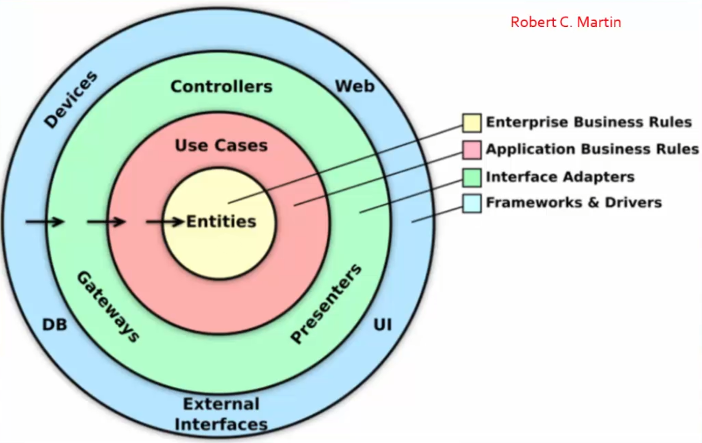

# Indice

- [Indice](#indice)
- [Oque é a Clean Archtecture](#oque-é-a-clean-archtecture)
- [Implementando](#implementando)
  - [Relacionamento Entre os Projetos](#relacionamento-entre-os-projetos)
  - [Pastas dos projetos](#pastas-dos-projetos)
  - [Classes](#classes)
- [Migrations para Clean Architecture](#migrations-para-clean-architecture)
- [Executando](#executando)

# Oque é a Clean Archtecture

> Leitura recomendada:    
> **Excelente artigo explicando sobre oque é e seus aspectos e como aplicar:    
>  [Usando a Clean Architecture - Macoratti](https://www.macoratti.net/20/10/aspnc_arqclean1.htm)**    

A Clean Architecture vem para resolver um problema com grandes projetos.    

**O Problema**    
- Projetos WebAPI usando o template padrão.
- Arquitetura monolítica com um único projeto.
- Criação de pastas para organizar o código.
- Forte acoplamento entre os componentes do projeto.
- Forte acoplamento com a UI, o acesso aos dados e as ferramentas ORM.

Esses problemas em um projeto pequeno são ok. Mas se o projeto pretende crescer, vão ser terríveis, o projeto vai se tornar ruim de ler, complexo de se atualizar, causando muito mais custo de tempo e dinheiro em seu mantimento ao longo do tempo.

**Solução:**  
- Definir uma arquitetura desacoplada e robusta.
- Criar projetos distintos separados conforme a sua responsabilidade.
- Usar a inversão de controle e injeção de dependência.

Dessa forma, o projeto se torna mais fácil de se manter, estender e testar. Suas partes podem ser mantidas e estendidas de forma avulsa, e muito mais organizada.

**Características desejadas em um arquitetura**

- Independente de Frameworks
- Testável
- Independente da camada de Apresentação (UI)
- Independente do Banco de dados
- Independente de fatores externos

Dentre as opções de arquitetura (Hexagonal, Screaming, Onion) temos a Clean Architecture proposta pelo Robert C. Martin, também conhecido por "Uncle Bob".

**Exemplo de camadas proposta pela Clean Architecture**    

- No centro, a camada mais interna, a que deve ser menos mexida, ficam as entidades de regras de negocio. **Ela não deve ter nenhuma dependência, nunca.**
- Na proxima camada temos os casos de uso, nessa camada estão os objetos que representam uma ação dentro do sistema, eles orquestram o fluxo de dados, ou seja, direcionam os dados para a aplicação da regra de negocio (aqui ficam os DTOs).
- A seguir temos os adaptadores e as Interfaces que é a camada responsável por realizar a comunicação entre as entidades e os componentes externos da aplicação.
- Na camada mais externa temos os frameworks e os driver, é uma camada composta por ferramentas como banco de dados, frameworks e outros recursos externos.

> **Importante!**
> 
> A diretriz principal da arquitetura limpa, é a **regra de dependência**!   
> Onde as camadas internas **não devem ter qualquer dependência das externas**, nem indiretas, como nomes de variáveis e funções.

[Voltar ao Índice](#índice)

---

# Implementando

Link do projeto: [CatalogoAPI_CleanArchitecture - GitHub](https://github.com/daniellfranco/CatalogoAPI_CleanArchitecture)

**Vamos criar nossa solução com 5 projetos distintos:**

- **Catalogo** - Nome da solução
  - Catalogo.**Domain** - Modelo de domínio, interfaces, regras de negócio.
  - Catalogo.**Application** - Regras da aplicação, serviços, mapeamentos, DTOs.
  - Catalogo.**Infrastructure** - Lógica de Acesso a dados, Contexto, Configurações, **ORM**.
  - Catalogo.**CrossCutting** - IoC (Inversion of Control), Registro dos Serviços e Recursos, DI (Dependency Injection).
  - Catalogo.**API** - Controladores, endpoints, filtros...

**Tipos de projeto**
- **Catalogo.API** - ASP.Net Core Web API.
- **Demais projetos** - Class Library.

Então via Visual Studio criamos uma "**Solução em Branco**" (Blank Solution), nesta solução vamos criar os 5 projetos citados acima (File > Add > New Project), o projeto Catalogo.API é criado como um Projeto Web API, os demais serão criados usando a opção "**Biblioteca de Classes**" (Class Library).

## Relacionamento Entre os Projetos

> "Botão direito no projeto > Adicionar > Referencia de Projeto"

- O Projeto **Domain** não tem dependência com nenhum projeto. Nunca deve ter. Nem interna nem externa.
- O Projeto **Application** faz referencia apenas ao projeto Domain.
- O Projeto **Infrastructure** tem referencia ao projeto Domain.
- O Projeto **CrossCutting** tem referencia aos projetos Domain, Application e Infrastructure.
- O Projeto **API** vai ter referencia ao projeto CrossCutting.

## Pastas dos projetos

> Lembrete: Isso não é uma receita de bolo, dependendo do projeto e da complexidade do projeto é possível ter mais projetos e mais pastas dentro de cada um.
> O importante é seguir a diretriz da clean architecture que é "nenhuma camada interna possui dependência de camadas externas".

- Domain (**Camada mais interna**, sem dependência de nada)
  - Entities - Onde se encontram nossos modelos de entidade (elas devem conter comportamento e propriedades).
  - Interfaces - Aqui vamos definir interfaces para implementar os repositórios, nos vamos implementa-las no projeto infrastructure, e é através dela que vamos acessar o modelo de domínio, e por definir interfaces não teremos acoplamento no domain.
  - Validation - Esta é um exemplo de como fazer validações de regra de negocio.

- Application (Dependências: AutoMapper, e Projeto Domain)
  - DTOs - aqui definimos os DTOs que são usados para não expor o modelo de domínio ao usuário final. E é aqui nos DTOs que fazemos validações e usamos as data annotations, no domain nunca devemos usar data annotations, pois isso polui o modelo de domínio.
  - Interfaces - Aqui definimos as interfaces que serão usadas para implementar os serviços, os serviços que vão aplicar os casos de uso relacionados com o modelo de domínio.
  - Mappings - Aqui fazemos o mapeamento dos DTOs (usando o AutoMapper).
  - Services - Aqui é onde implementamos as interfaces definidas na pasta Interfaces *deste* projeto.

- Infrastructure (Dependências: "EFCore Design", "EFCore SqlServer", e Projeto Domain)
  - Context - Criamos a classe que vai fazer o mapeamento das entidades para o banco de dados.
  - EntitiesConfiguration - Usamos a fluentAPI para definir as configurações das entidades. Fazemos isso aqui pois o EFCore vai ser instalado nesse projeto, e o Domain não pode ter nenhuma dependência e "nem saber que isso existe".
  - Repositories - Fazemos os repositórios que irão utilizar as interfaces criadas no Domain.

- CrossCutting (Dependências: "AutoMapper DependencyInjection", "Microsoft DependencyInjection Abstractions", e Projetos Infrastructure, Application e Domain)
  - IoC - Definimos uma classe e um método de extensão onde vamos registrar o serviço. Aqui vamos usar o Contêiner de injeção de dependência nativo da aspnet.core, vamos registrar o serviço do EFCore (**AddDbContext fica aqui**), os serviços definidos na camada Application, e os serviços do repositório.

- API (**Camada mais Externa**, possui dependências padrões do modelo de projeto WebAPI, e dependência ao projeto CrossCutting)
  - Controllers - Definimos as controladoras aqui.

## Classes

> Link do projeto: [CatalogoAPI_CleanArchitecture - GitHub](https://github.com/daniellfranco/CatalogoAPI_CleanArchitecture)

Em sequencia de criação.

- Domain
  - Entities
    - [Entity.cs](https://github.com/daniellfranco/CatalogoAPI_CleanArchitecture/blob/main/Catalogo/Catalogo.Domain/Entities/Entity.cs) - É uma classe abstrata que contem a propriedade ID (e pode conter outras) que tem seu uso repetido em categoria.cs e produto.cs.
    - [Categoria.cs](https://github.com/daniellfranco/CatalogoAPI_CleanArchitecture/blob/main/Catalogo/Catalogo.Domain/Entities/Categoria.cs) e [Produto.cs](https://github.com/daniellfranco/CatalogoAPI_CleanArchitecture/blob/main/Catalogo/Catalogo.Domain/Entities/Produto.cs) -  Herda de entity, é o nosso modelo de entidade, ela deve usar o modificador **"Sealed"**, indicando que ela **não poderá ser herdada** , isso é uma forma de isolar a entidade do mundo externo, encapsulando-a.
  - Interfaces
    - [ICategoriaRepository.cs](https://github.com/daniellfranco/CatalogoAPI_CleanArchitecture/tree/main/Catalogo/Catalogo.Domain/Interfaces/ICategoriaRepository.cs) e [IProdutoRepository.cs](https://github.com/daniellfranco/CatalogoAPI_CleanArchitecture/tree/main/Catalogo/Catalogo.Domain/Interfaces/IProdutoRepository.cs) - Essas interfaces servem para conseguirmos acessar as entidades de domínio sem fazer nenhum acoplamento no Domain, elas serão implementadas pelo repositório do projeto Infrastructure.
  - Validation 
    - [DomainExceptionValidation.cs](https://github.com/daniellfranco/CatalogoAPI_CleanArchitecture/blob/main/Catalogo/Catalogo.Domain/Validation/DomainExceptionValidation.cs) - Essa classe é um validador simples para exemplo de validação a nível de regra de negocio.
    
- Application
  - DTOs
    - [CategoriaDTO.cs](https://github.com/daniellfranco/CatalogoAPI_CleanArchitecture/blob/main/Catalogo/Catalogo.Application/DTOs/CategoriaDTO.cs) e [ProdutoDTO.cs](https://github.com/daniellfranco/CatalogoAPI_CleanArchitecture/blob/main/Catalogo/Catalogo.Application/DTOs/ProdutoDTO.cs) - São as nossas DTOs para evitar a exposição das entidades de domínio ao mundo exterior. Usamos Data Annotations aqui para fazer validações.
  - Mappings
    - [DomainToDTOMappingProfile.cs](https://github.com/daniellfranco/CatalogoAPI_CleanArchitecture/blob/main/Catalogo/Catalogo.Application/Mappings/DomainToDTOMappingProfile.cs) - Aqui é feito a configuração de mapeamento via AutoMapper entre nossas DTOs e as Entidades de Domínio.
  - Interfaces
    - [ICategoriaService.cs](https://github.com/daniellfranco/CatalogoAPI_CleanArchitecture/blob/main/Catalogo/Catalogo.Application/Interfaces/ICategoriaService.cs) e [IProdutoService.cs](https://github.com/daniellfranco/CatalogoAPI_CleanArchitecture/blob/main/Catalogo/Catalogo.Application/Interfaces/IProdutoService.cs) - Serve para realizar as operações com categorias e/ou produtos, expõe somente as informações do DTO e não do domínio, sua implementação é feita na pasta Services.
  - Services
    - [CategoriaService.cs](https://github.com/daniellfranco/CatalogoAPI_CleanArchitecture/blob/main/Catalogo/Catalogo.Application/Services/CategoriaService.cs) e [ProdutoService.cs](https://github.com/daniellfranco/CatalogoAPI_CleanArchitecture/blob/main/Catalogo/Catalogo.Application/Services/ProdutoService.cs) - É a implementação das interfaces acima, e recebe a injeção do repositório (ex. Catalogo.Domain.Interfaces.ICategoriaRepository.cs) e do AutoMapper

- Infrastructure 
  - [Catalogo.Infrastructure.csproj](https://github.com/daniellfranco/CatalogoAPI_CleanArchitecture/blob/main/Catalogo/Catalogo.Infrastructure/Catalogo.Infrastructure.csproj) - Quando adicionar o pacote do EFCore Design, tem que mudar o PrivateAssets dele de all para none para o migrations funcionar corretamente.
  - EntitiesConfiguration
    - [CategoriaConfiguration.cs](https://github.com/daniellfranco/CatalogoAPI_CleanArchitecture/blob/main/Catalogo/Catalogo.Infrastructure/EntitiesConfiguration/CategoriaConfiguration.cs) e [ProdutoConfiguration.cs](https://github.com/daniellfranco/CatalogoAPI_CleanArchitecture/blob/main/Catalogo/Catalogo.Infrastructure/EntitiesConfiguration/ProdutoConfiguration.cs) - Usamos a FluentAPI para configurar as propriedades e relacionamento.
  - Context
    - [ApplicationDbContext.cs](https://github.com/daniellfranco/CatalogoAPI_CleanArchitecture/blob/main/Catalogo/Catalogo.Infrastructure/Context/ApplicationDbContext.cs) - Definimos as opções do contexto do EFCore, e em OnModelCreating aplicamos as configurações feitas em EntitiesConfiguration.
  - Repositories
    - [CategoriaRepository.cs](https://github.com/daniellfranco/CatalogoAPI_CleanArchitecture/blob/main/Catalogo/Catalogo.Infrastructure/Repositories/CategoriaRepository.cs) e [ProdutoRepository.cs](https://github.com/daniellfranco/CatalogoAPI_CleanArchitecture/blob/main/Catalogo/Catalogo.Infrastructure/Repositories/ProdutoRepository.cs) - Implementa as interfaces que estão no projeto Domain.
  - Migrations - Adicionado pelo comando do migrations, ela deve ficar aqui em infrastructure
  - Identity - Não usado neste exemplo, mas se for usar o Identity ele vai aqui em Infrastructure.

- CrossCutting
  - IoC
    - [DependencyInjection.cs](https://github.com/daniellfranco/CatalogoAPI_CleanArchitecture/blob/main/Catalogo/Catalogo.CrossCutting/IoC/DependencyInjection.cs) - **O AddDbContext fica aqui**, ela essa classe possui um método abstrato **"AddInfrastructure"** que será chamada la no program.cs do projeto Catalogo.API, nela configuramos os serviços AddDbContext para conectar ao banco de dados, e os serviços CategoriaRepository, ProdutoRepository, ProdutoService e CategoriaService, com suas respectivas interfaces, e também o AutoMapper.

- API
  - [Controllers](https://github.com/daniellfranco/CatalogoAPI_CleanArchitecture/tree/main/Catalogo/Catalogo.API/Controllers) - As controladoras...
  - [Program.cs](https://github.com/daniellfranco/CatalogoAPI_CleanArchitecture/blob/main/Catalogo/Catalogo.API/Program.cs) - O principal aqui, é chamar a o método abstrato AddInfrastructure que está em IoC, ele fara adição de tudo os serviços que estão configurados lá. E também é importante configurar em AddControllers() uma opção de json para evitar erros de referencia cíclica (veja o exemplo no arquivo).
  

[Voltar ao Índice](#índice)

---

# Migrations para Clean Architecture

Para aplicar o migrations com a clean architecture é um pouco diferente.    

Primeiro vamos aos detalhes no projeto.   
- Em Infrastructure/[Catalogo.Infrastructure.csproj](https://github.com/daniellfranco/CatalogoAPI_CleanArchitecture/blob/main/Catalogo/Catalogo.Infrastructure/Catalogo.Infrastructure.csproj) temos que deixar o PrivateAssets como none, senão dá erro.   
- Em CrossCutting/IoC/[DependencyInjection.cs](https://github.com/daniellfranco/CatalogoAPI_CleanArchitecture/blob/main/Catalogo/Catalogo.CrossCutting/IoC/DependencyInjection.cs) temos que colocar um comando extra em AddDbContext como você pode conferir acessando o link do arquivo. Esse comando vai definir o projeto que ele irá apontar.

Então via linha de comando, na raiz do projeto, usamos os seguintes comandos:     
- `dotnet-ef migrations add Initial -s Catalogo.API -p Catalogo.Infrastructure`     
- `dotnet-ef database update -s Catalogo.API -p Catalogo.Infrastructure`     

Se der algum erro, e estiver correto os detalhes acima, experimente definir o Catalogo.API como Projeto de Inicialização (explico como no tópico abaixo) se ainda não tiver definido.

[Voltar ao Índice](#índice)

---

# Executando

Para executar o projeto, você precisa clicar com o botão direito em **Catalogo.API**, e ir até até a opção "**Definir como Projeto de Inicialização**" e clicar, agora deve dar para executar o projeto normalmente como em um projeto simples.

[Voltar ao Índice](#índice)